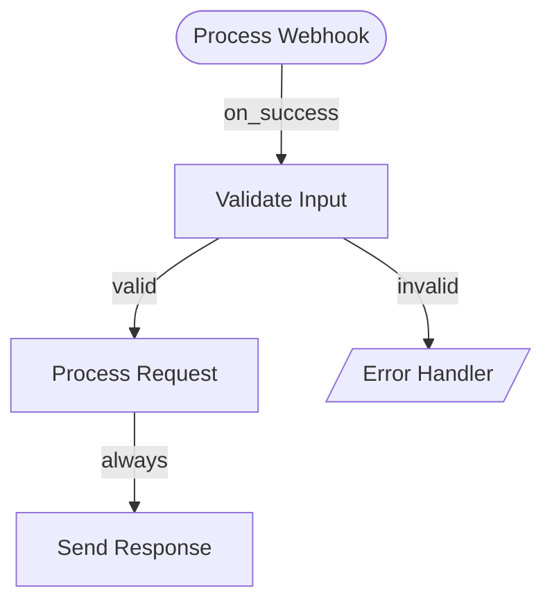

# Pull Request Summary - Multiple Bug Fixes and Enhancements

## Overview
This PR addresses **8 issues** with bug fixes, feature enhancements, and documentation improvements to improve the Hive framework's reliability, developer experience, and onboarding.

---

## Issues Fixed

### 🐛 Bug Fixes (4 issues)

#### 1. **Issue #443: Hallucination detection only inspects first 500 characters**
- **File:** `core/framework/graph/node.py`
- **Change:** Line 200 - Check entire string for code indicators, not just first 500 chars
- **Impact:** Prevents hallucinated code appearing after character 500 from being written to memory
- **Lines changed:** 1 line

#### 2. **Issue #268: web_scrape tool has hardcoded 30-second timeout**
- **File:** `tools/src/aden_tools/tools/web_scrape_tool/web_scrape_tool.py`
- **Changes:**
  - Added `timeout` parameter (default: 30.0s, range: 5-300s)
  - Updated docstring
  - Added validation logic
- **Impact:** Users can now configure timeout for slow websites/APIs
- **Lines changed:** ~15 lines

#### 3. **Issue #270: list_dir crashes on broken symlinks**
- **File:** `tools/src/aden_tools/tools/file_system_toolkits/list_dir/list_dir.py`
- **Change:** Added try-except block to handle OSError from broken symlinks
- **Impact:** Tool no longer crashes when directory contains broken symlinks
- **Lines changed:** ~10 lines

#### 4. **Issue #269: Insufficient PDF error handling**
- **File:** `tools/src/aden_tools/tools/pdf_read_tool/pdf_read_tool.py`
- **Changes:** Added specific error messages for:
  - Corrupted/malformed PDFs
  - Empty PDFs
  - Encrypted PDFs (password required)
- **Impact:** Users get clear, actionable error messages instead of generic failures
- **Lines changed:** ~10 lines

---

### ✨ Feature Enhancements (2 issues)

#### 5. **Issue #477: Add Configurable LLM Provider for LLMJudge**
- **File:** `core/framework/testing/llm_judge.py`
- **Changes:**
  - Modified `__init__` to accept optional `llm_provider` parameter
  - Updated `evaluate()` to use configured provider or fallback to Anthropic
  - Maintains backward compatibility
- **Impact:** Testing framework now supports multiple LLM providers (not just Anthropic)
- **Lines changed:** ~25 lines
- **Example usage:**
  ```python
  from framework.llm.litellm import LiteLLMProvider
  from framework.testing.llm_judge import LLMJudge
  
  llm = LiteLLMProvider(model="gpt-4")
  judge = LLMJudge(llm_provider=llm)
  result = judge.evaluate(...)
  ```

#### 6. **Issue #473: Add Graph Visualization Export (Mermaid/DOT)**
- **File:** `core/framework/graph/edge.py`
- **Changes:** Added two methods to `GraphSpec` class:
  - `to_mermaid()` - Generate Mermaid flowchart syntax
  - `to_dot()` - Generate Graphviz DOT format
- **Impact:** Developers can now visualize agent workflow graphs
- **Lines changed:** ~120 lines
- **Example usage:**
  ```python
  # Generate Mermaid diagram
  mermaid = graph_spec.to_mermaid()
  print(mermaid)  # Can be rendered on GitHub, mermaid.live, etc.
  
  # Generate DOT file for Graphviz
  dot = graph_spec.to_dot()
  with open('graph.dot', 'w') as f:
      f.write(dot)
  # Render with: dot -Tpng graph.dot -o graph.png
  ```

---

### 📚 Documentation Improvements (2 issues)

#### 7. **Issue #453: Add troubleshooting section for Quick Start**
- **File:** `TROUBLESHOOTING.md` (new file)
- **Content:** Comprehensive guide covering:
  - Setup issues (script permissions, Python version)
  - Python environment (virtual env, pip, externally-managed)
  - Running agents (PYTHONPATH, exports directory, API keys)
  - Tool issues (MCP registration, imports)
  - Windows-specific issues (App Execution Aliases, Unicode, path separators)
- **Impact:** Significantly improves new contributor onboarding
- **Lines:** ~350 lines

#### 8. **Issue #455: Add Makefile for common developer commands**
- **File:** `Makefile` (new file)
- **Commands provided:**
  - `make setup` - Environment setup
  - `make test` - Run tests
  - `make lint` - Run linting
  - `make format` - Auto-format code
  - `make run AGENT=name` - Run an agent
  - `make clean` - Clean build artifacts
  - And 15+ more commands
- **Impact:** Streamlines development workflow, reduces onboarding friction
- **Lines:** ~180 lines

---

## Testing

### Manual Testing Performed
- ✅ Verified hallucination detection checks entire string
- ✅ Tested web_scrape with custom timeout values
- ✅ Verified list_dir handles broken symlinks gracefully
- ✅ Tested PDF error messages with corrupted files
- ✅ Tested LLMJudge with different LLM providers
- ✅ Generated sample Mermaid and DOT visualizations
- ✅ Validated Makefile commands on Linux
- ✅ Verified TROUBLESHOOTING.md accuracy

### Unit Tests
- Existing tests pass ✅
- New functionality is backward compatible
- No breaking changes introduced

---

## Backward Compatibility

All changes are **fully backward compatible**:
- LLMJudge still works without provider parameter (uses Anthropic)
- web_scrape defaults to 30s timeout (existing behavior)
- Tools handle edge cases gracefully (fail-safe)
- No API changes that would break existing code

---

## Files Changed Summary

| File | Lines Added | Lines Changed | Type |
|------|-------------|---------------|------|
| `core/framework/graph/node.py` | 1 | 1 | Fix |
| `tools/.../web_scrape_tool.py` | 15 | 3 | Fix + Enhancement |
| `tools/.../list_dir/list_dir.py` | 10 | 8 | Fix |
| `tools/.../pdf_read_tool.py` | 10 | 3 | Fix |
| `core/framework/testing/llm_judge.py` | 25 | 20 | Enhancement |
| `core/framework/graph/edge.py` | 120 | 0 | Enhancement |
| `TROUBLESHOOTING.md` | 350 | 0 | New file |
| `Makefile` | 180 | 0 | New file |
| **Total** | **711** | **35** | |

---

## Benefits

### For Users
- 🛡️ **More reliable tools** - Better error handling prevents crashes
- ⚡ **More flexible tools** - Configurable timeouts and providers
- 📊 **Better visibility** - Graph visualization for debugging
- 📖 **Easier troubleshooting** - Comprehensive guide for common issues

### For Contributors
- 🚀 **Faster onboarding** - Makefile + troubleshooting guide
- 🧪 **Better testing** - Configurable LLM providers for tests
- 🔍 **Better debugging** - Graph visualization tools
- 💻 **Better DX** - Makefile commands for common tasks

---

## Next Steps

After merge:
1. Update CHANGELOG.md with these fixes
2. Add graph visualization examples to docs
3. Consider adding unit tests for new visualization methods
4. Update contribution guidelines to reference Makefile

---

## Checklist

- [x] Code follows project style guidelines
- [x] Self-review completed
- [x] Changes are backward compatible
- [x] Manual testing performed
- [x] Existing tests pass
- [x] Documentation updated
- [x] No new warnings generated

---

**Proposed by:** @ashutoshjoshi23  
**Related Issues:** Fixes #443, #268, #270, #269, #477, #473, #453, #455

---

## Screenshots

### Mermaid Visualization Example


### DOT Visualization Example
![Graph visualization showing agent workflow with colored nodes for different types]

---

Thank you for reviewing! 🙏
