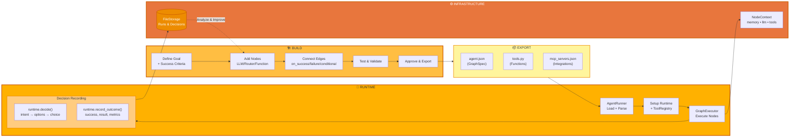
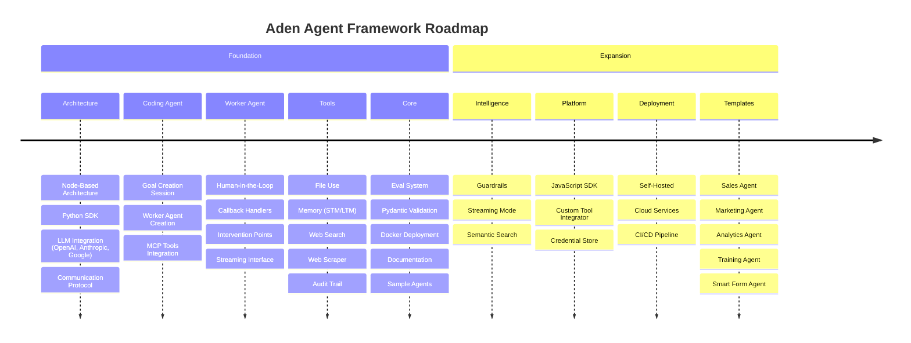

<p align="center">
  
</p>

<p align="center">
  <a href="README.md">English</a> |
  <a href="README.zh-CN.md">简体中文</a> |
  <a href="README.es.md">Español</a> |
  <a href="README.pt.md">Português</a> |
  <a href="README.ja.md">日本語</a> |
  <a href="README.ru.md">Русский</a> |
  <a href="README.ko.md">한국어</a>
</p>

[](https://github.com/adenhq/hive/blob/main/LICENSE)
[](https://www.ycombinator.com/companies/aden)
[](https://hub.docker.com/u/adenhq)
[](https://discord.com/invite/MXE49hrKDk)
[](https://x.com/aden_hq)
[](https://www.linkedin.com/company/teamaden/)

<p align="center">
  
  
  
  
  
</p>
<p align="center">
  
  
  
  
</p>

## 개요

워크플로우를 하드코딩하지 않고 신뢰성 있고 스스로 개선하는 AI 에이전트를 구축하세요. 코딩 에이전트와의 대화를 통해 목표를 정의하면, 프레임워크가 동적으로 생성된 연결 코드가 포함된 노드 그래프를 만들어 줍니다. 문제가 생기면 프레임워크가 실패 데이터를 수집하고, 코딩 에이전트를 통해 에이전트를 진화시키며, 다시 배포합니다. 내장된 인간 개입(HITL) 노드, 자격 증명 관리, 실시간 모니터링으로 적응성을 잃지 않으면서도 제어력을 유지할 수 있습니다.

전체 문서, 예제, 가이드는 [adenhq.com](https://adenhq.com)에서 확인하세요.

## Aden이란

<p align="center">
  
</p>

Aden은 AI 에이전트의 구축, 배포, 운영, 적응을 위한 플랫폼입니다:

- **구축** - 코딩 에이전트가 자연어 목표로부터 특화된 워커 에이전트(세일즈, 마케팅, 운영)를 생성
- **배포** - CI/CD 연동과 완전한 API 수명주기 관리를 갖춘 헤드리스 배포
- **운영** - 실시간 모니터링, 가시성, 런타임 가드레일로 에이전트 신뢰성 유지
- **적응** - 지속적인 평가·감독·적응으로 시간이 지날수록 개선
- **인프라** - 공유 메모리, LLM 통합, 도구, 스킬이 모든 에이전트를 지원

## 빠른 링크

- **[문서](https://docs.adenhq.com/)** - 전체 가이드 및 API 레퍼런스
- **[셀프 호스팅 가이드](https://docs.adenhq.com/getting-started/quickstart)** - Hive를 인프라에 배포
- **[변경 이력](https://github.com/adenhq/hive/releases)** - 최신 업데이트와 릴리스
<!-- - **[로드맵](https://adenhq.com/roadmap)** - 예정 기능과 계획 -->
- **[이슈 제보](https://github.com/adenhq/hive/issues)** - 버그 리포트 및 기능 요청

## 빠른 시작

### 사전 준비물

- [Python 3.11+](https://www.python.org/downloads/) - 에이전트 개발용
- [Docker](https://docs.docker.com/get-docker/) (v20.10+) - 선택 사항, 컨테이너화된 도구용

### 설치

```bash
# 리포지토리 클론
git clone https://github.com/adenhq/hive.git
cd hive

# Python 환경 설정 실행
./scripts/setup-python.sh
```

설치되는 항목:
- **framework** - 코어 에이전트 런타임 및 그래프 실행기
- **aden_tools** - 에이전트 기능을 위한 19개 MCP 도구
- 필요한 모든 의존성

### 첫 번째 에이전트 만들기

```bash
# Claude Code 스킬 설치(최초 1회)
./quickstart.sh

# Claude Code로 에이전트 빌드
claude> /building-agents

# 에이전트 테스트
claude> /testing-agent

# 에이전트 실행
PYTHONPATH=core:exports python -m your_agent_name run --input '{...}'
```

**[📖 전체 설정 가이드](ENVIRONMENT_SETUP.md)** - 에이전트 개발을 위한 상세 절차

## 주요 기능

- **목표 중심 개발** - 자연어로 목표를 정의하면 코딩 에이전트가 달성을 위한 그래프와 연결 코드를 생성
- **자체 적응 에이전트** - 프레임워크가 실패를 기록·분석해 목표와 그래프를 갱신
- **동적 노드 연결** - 사전 정의된 엣지 없이 목표에 따라 연결 코드가 생성
- **SDK 래핑 노드** - 모든 노드가 공유 메모리, 로컬 RLM 메모리, 모니터링, 도구, LLM 액세스를 기본 제공
- **HITL(인간 개입)** - 사용자 입력을 위해 실행을 일시 중지하는 개입 노드(타임아웃·에스컬레이션 설정 가능)
- **실시간 가시성** - WebSocket 스트리밍으로 실행, 의사결정, 노드 간 통신을 실시간 관찰
- **비용·예산 관리** - 지출 한도, 스로틀, 자동 모델 디그레이드 정책 지원
- **프로덕션 준비** - 셀프 호스팅 가능, 확장성과 신뢰성을 고려한 설계

## 왜 Aden인가

기존 프레임워크는 워크플로우를 수동으로 설계하고, 에이전트 상호작용을 정의하며, 실패를 사후적으로 처리해야 합니다. Aden은 이 패러다임을 뒤집습니다 — **원하는 결과를 기술하면 시스템이 스스로 구성**합니다.



### Aden의 강점

| 전통적 프레임워크          | Aden                                  |
| -------------------------- | ------------------------------------- |
| 에이전트 워크플로우 하드코딩 | 자연어로 목표 기술                   |
| 그래프 수동 정의           | 자동 생성되는 에이전트 그래프         |
| 사후적 오류 처리           | 선제적 자기 진화                     |
| 정적 도구 구성             | 동적 SDK 래핑 노드                   |
| 별도 모니터링 구성         | 내장 실시간 가시성                   |
| DIY 예산 관리              | 통합 비용 제어 및 디그레이드         |

### 작동 방식

1. **목표 정의** → 달성하고자 하는 바를 평이한 언어로 기술
2. **코딩 에이전트 생성** → 에이전트 그래프, 연결 코드, 테스트 케이스 생성
3. **워커 실행** → SDK 래핑 노드가 가시성과 도구 접근을 갖고 실행
4. **컨트롤 플레인 모니터링** → 실시간 지표, 예산 집행, 정책 관리
5. **자기 개선** → 실패 시 그래프를 진화시키고 자동 재배포

## Aden 비교 관점

Aden은 에이전트 개발에 대해 근본적으로 다른 접근을 합니다. 대부분의 프레임워크가 워크플로우 하드코딩이나 그래프 수동 정의를 요구하는 반면, Aden은 **자연어 목표로부터 코딩 에이전트가 전체 시스템을 생성**합니다. 에이전트가 실패하면 단순 로깅에 그치지 않고, **그래프를 자동으로 진화**시킨 뒤 재배포합니다.

### 비교 표

| 프레임워크                           | 카테고리                | 접근 방식                                                     | Aden의 차별점                                  |
| ----------------------------------- | ----------------------- | ------------------------------------------------------------- | ---------------------------------------------- |
| **LangChain, LlamaIndex, Haystack** | 컴포넌트 라이브러리     | RAG/LLM 앱용 구성요소; 연결 로직은 수동                      | 그래프와 연결 코드를 선제적으로 전체 생성     |
| **CrewAI, AutoGen, Swarm**          | 멀티 에이전트 오케스트레이션 | 사전 정의된 역할·협업 패턴                                  | 에이전트/연결을 동적으로 생성; 실패 시 적응   |
| **PydanticAI, Mastra, Agno**        | 타입 안전 프레임워크    | 예측 가능한 워크플로우의 구조화 출력·검증                   | 진화하는 워크플로우; 구조는 반복을 통해 도출  |
| **Agent Zero, Letta**               | 개인 비서형             | 메모리·학습; OS-as-Tool 또는 상태 기반 메모리                | 프로덕션급 다중 에이전트와 자체 복구           |
| **CAMEL**                           | 리서치 프레임워크       | 대규모 시뮬레이션에서의 창발 행동 연구                       | 운영 지향, 신뢰 가능한 실행·복구               |
| **TEN Framework, Genkit**           | 인프라 프레임워크       | 실시간 멀티모달(TEN) 또는 풀스택 AI(Genkit)                  | 더 높은 추상화—에이전트 로직 생성·진화        |
| **GPT Engineer, Motia**             | 코드 생성               | 명세→코드(GPT Engineer) 또는 "Step" 원시 연산(Motia)         | 실패 자동 복구를 갖춘 자기 적응 그래프         |
| **Trading Agents**                  | 도메인 특화             | LangGraph 위 하드코딩된 트레이딩 역할                        | 도메인 불문; 어떤 유스케이스에도 구조 생성     |

### Aden을 선택할 때

다음이 필요하다면 Aden을 선택하세요:

- 수동 개입 없이 **실패로부터 스스로 개선**하는 에이전트
- 워크플로우가 아닌 결과를 기술하는 **목표 중심 개발**
- 자동 복구·재배포가 가능한 **프로덕션 신뢰성**
- 코드 재작성 없이 **에이전트 아키텍처의 빠른 반복**
- 실시간 모니터링과 사람 감독을 갖춘 **완전한 가시성**

다른 프레임워크가 더 적합한 경우:

- **타입 안전하고 예측 가능한 워크플로우**(PydanticAI, Mastra)
- **RAG 및 문서 처리**(LlamaIndex, Haystack)
- **에이전트 창발 연구**(CAMEL)
- **실시간 음성/멀티모달**(TEN Framework)
- **간단한 컴포넌트 체이닝**(LangChain, Swarm)

## 프로젝트 구조

```
hive/
├── core/                   # 코어 프레임워크 - 에이전트 런타임, 그래프 실행기, 프로토콜
├── tools/                  # MCP 도구 패키지 - 에이전트 기능용 19개 도구
├── exports/                # 에이전트 패키지 - 사전 구축된 에이전트와 예제
├── docs/                   # 문서와 가이드
├── scripts/                # 빌드 및 유틸리티 스크립트
├── .claude/                # 에이전트 구축용 Claude Code 스킬
├── ENVIRONMENT_SETUP.md    # 에이전트 개발을 위한 Python 설정 가이드
├── DEVELOPER.md            # 개발자 가이드
├── CONTRIBUTING.md         # 기여 가이드라인
└── ROADMAP.md              # 제품 로드맵
```

## 개발

### Python 에이전트 개발

프레임워크로 목표 중심 에이전트를 빌드·실행하려면:

```bash
# 1회 설정
./scripts/setup-python.sh

# 설치되는 항목:
# - framework 패키지(코어 런타임)
# - aden_tools 패키지(19개 MCP 도구)
# - 모든 의존성

# Claude Code 스킬로 새 에이전트 빌드
claude> /building-agents

# 에이전트 테스트
claude> /testing-agent

# 에이전트 실행
PYTHONPATH=core:exports python -m agent_name run --input '{...}'
```

자세한 설정 지침은 [ENVIRONMENT_SETUP.md](ENVIRONMENT_SETUP.md)를 참고하세요.

## 문서

- **[개발자 가이드](DEVELOPER.md)** - 개발자를 위한 종합 가이드
- [시작하기](docs/getting-started.md) - 빠른 설정 안내
- [구성 가이드](docs/configuration.md) - 모든 구성 옵션
- [아키텍처 개요](docs/architecture.md) - 시스템 설계와 구조

## 로드맵

Aden 에이전트 프레임워크는 개발자가 결과 지향적이며 자체 적응하는 에이전트를 만들 수 있도록 돕는 것을 목표로 합니다. 로드맵은 아래에서 확인하세요.

[ROADMAP.md](ROADMAP.md)



## 커뮤니티 및 지원

지원, 기능 요청, 커뮤니티 논의는 [Discord](https://discord.com/invite/MXE49hrKDk)를 사용합니다.

- Discord - [커뮤니티 참여](https://discord.com/invite/MXE49hrKDk)
- Twitter/X - [@adenhq](https://x.com/aden_hq)
- LinkedIn - [회사 페이지](https://www.linkedin.com/company/teamaden/)

## 기여하기

여러분의 기여를 환영합니다! 가이드라인은 [CONTRIBUTING.md](CONTRIBUTING.md)를 참고하세요.

1. 리포지토리를 포크합니다
2. 기능 브랜치를 생성합니다 (`git checkout -b feature/amazing-feature`)
3. 변경 사항을 커밋합니다 (`git commit -m 'Add amazing feature'`)
4. 브랜치에 푸시합니다 (`git push origin feature/amazing-feature`)
5. 풀 리퀘스트를 생성합니다

## 팀 합류

**채용 중!** 엔지니어링, 리서치, GTM 역할에서 함께할 동료를 찾고 있습니다.

[채용 공고 보기](https://jobs.adenhq.com/a8cec478-cdbc-473c-bbd4-f4b7027ec193/applicant)

## 보안

보안 관련 문의는 [SECURITY.md](SECURITY.md)를 참고하세요.

## 라이선스

이 프로젝트는 Apache License 2.0에 따라 제공됩니다. 자세한 내용은 [LICENSE](LICENSE) 파일을 참고하세요.

## 자주 묻는 질문 (FAQ)

**Q: Aden은 LangChain 등 다른 에이전트 프레임워크에 의존하나요?**

아니요. Aden은 LangChain, CrewAI 등 다른 프레임워크에 의존하지 않고 처음부터 설계되었습니다. 사전 정의된 컴포넌트에 의존하기보다, 목표에 맞춰 에이전트 그래프를 동적으로 생성하는 가볍고 유연한 프레임워크입니다.

**Q: 어떤 LLM 제공자를 지원하나요?**

LiteLLM 통합을 통해 100개 이상의 LLM 제공자를 지원합니다. OpenAI(GPT-4, GPT-4o), Anthropic(Claude), Google Gemini, Mistral, Groq 등을 포함합니다. 적절한 API 키 환경 변수를 설정하고 모델명을 지정하면 됩니다.

**Q: Ollama 같은 로컬 모델도 사용할 수 있나요?**

네. `ollama/model-name` 형식(예: `ollama/llama3`, `ollama/mistral`)의 모델명을 사용하고 로컬에서 Ollama를 실행 중이면 됩니다.

**Q: Aden은 무엇이 다른가요?**

코딩 에이전트가 자연어 목표로부터 전체 에이전트 시스템을 생성합니다—워크플로우를 하드코딩하거나 그래프를 수동 정의할 필요가 없습니다. 실패 시 프레임워크가 실패 데이터를 캡처하고 그래프를 진화시켜 재배포하는 **자기 개선 루프**를 갖습니다.

**Q: 인간 개입(HITL) 워크플로우를 지원하나요?**

네. 개입 노드를 통해 실행을 일시 중지하고 사용자 입력을 받을 수 있습니다. 설정 가능한 타임아웃과 에스컬레이션 정책으로 전문가와 AI 에이전트의 협업을 지원합니다.

**Q: 어떤 모니터링·디버깅 도구를 제공하나요?**

실시간 WebSocket 스트리밍, TimescaleDB 기반 비용·성능 분석, Kubernetes 연계를 위한 헬스 체크, 예산/상태/정책 제어용 19개 MCP 도구 등 종합적인 가시성을 제공합니다.

**Q: 어떤 언어를 지원하나요?**

Python과 JavaScript/TypeScript용 SDK를 제공합니다. 백엔드는 Node.js/TypeScript, 프런트엔드는 React/TypeScript입니다.

**Q: 외부 도구와 API 연동이 가능한가요?**

가능합니다. SDK 래핑 노드로 다양한 도구 생태계를 지원하며, API·데이터베이스·외부 서비스와 유연하게 통합할 수 있습니다.

**Q: 비용 제어는 어떻게 동작하나요?**

지출 한도, 스로틀, 자동 모델 디그레이드 정책 등 세분화된 예산 제어를 제공합니다. 팀·에이전트·워크플로우 단위로 예산을 설정하고, 실시간 비용 추적과 알림을 지원합니다.

**Q: 예제와 문서는 어디서 볼 수 있나요?**

[docs.adenhq.com](https://docs.adenhq.com/)에서 전체 가이드, API 레퍼런스, 시작 튜토리얼을 확인하세요. 리포지토리의 `docs/` 폴더와 [DEVELOPER.md](DEVELOPER.md)도 참고하세요.

---

<p align="center">
  샌프란시스코에서 🔥 열정을 담아 만들었습니다
</p>

