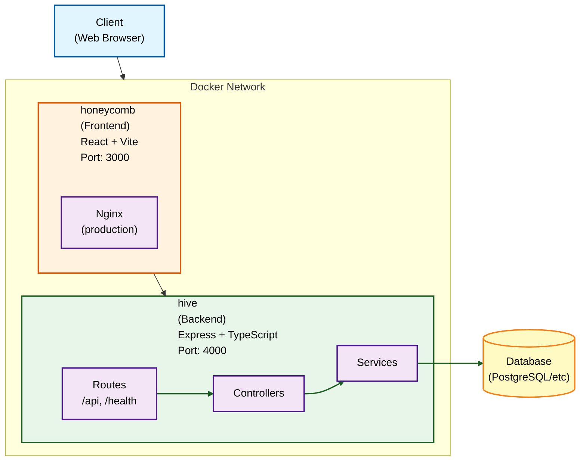

# Architecture Overview

This document describes the high-level architecture of Hive.

## System Overview



## Components

### Frontend (honeycomb/)

The frontend is a single-page application built with:

- **React 18** - UI library
- **TypeScript** - Type safety
- **Vite** - Build tool and dev server
- **React Router** - Client-side routing

**Key Directories:**

| Directory | Purpose |
|-----------|---------|
| `src/components/` | Reusable UI components |
| `src/pages/` | Page-level components (routes) |
| `src/hooks/` | Custom React hooks |
| `src/services/` | API client and external services |
| `src/types/` | TypeScript type definitions |
| `src/utils/` | Utility functions |
| `src/styles/` | Global styles and CSS |

**Production Build:**
- Vite builds static assets
- Nginx serves the built files
- API requests proxied to backend

### Backend (hive/)

The backend is a RESTful API built with:

- **Express** - Web framework
- **TypeScript** - Type safety
- **Zod** - Runtime validation
- **Helmet** - Security headers

**Key Directories:**

| Directory | Purpose |
|-----------|---------|
| `src/routes/` | API route definitions |
| `src/controllers/` | Request handlers |
| `src/services/` | Business logic |
| `src/middleware/` | Express middleware |
| `src/models/` | Data models |
| `src/types/` | TypeScript types |
| `src/utils/` | Utility functions |
| `src/config/` | Configuration loading |

**API Structure:**

```
GET  /health           # Health check endpoints
GET  /health/ready     # Readiness probe
GET  /health/live      # Liveness probe

GET  /api              # API info
GET  /api/users        # Example resource
```

## Request Flow

1. **Client** makes HTTP request
2. **Nginx** (production) or **Vite** (dev) receives request
3. Static assets served directly; API requests proxied
4. **Express** receives API request
5. **Middleware** processes (auth, logging, validation)
6. **Router** matches route to controller
7. **Controller** handles request, calls services
8. **Service** executes business logic
9. **Response** returned to client

## Configuration System

```
config.yaml
    │
    ▼
generate-env.ts  ──────────────────┐
    │                              │
    ▼                              ▼
.env (root)              honeycomb/.env
    │                              │
    ▼                              ▼
docker-compose.yml        Vite (frontend)
    │
    ▼
hive/.env
    │
    ▼
Express (backend)
```

## Docker Architecture

**Production:**
```
docker-compose.yml
├── honeycomb (frontend)
│   └── Dockerfile (multi-stage: build → nginx)
└── hive (backend)
    └── Dockerfile (multi-stage: build → node)
```

**Development:**
```
docker-compose.yml + docker-compose.override.yml
├── honeycomb (frontend)
│   └── Dockerfile.dev (vite dev server)
└── hive (backend)
    └── Dockerfile.dev (tsx watch)
```

## Scaling Considerations

### Horizontal Scaling

Both frontend and backend are stateless and can be scaled horizontally:

```yaml
# docker-compose.yml
services:
  hive:
    deploy:
      replicas: 3
```

### Database

- Use connection pooling
- Consider read replicas for heavy read loads
- Implement caching layer if needed

### Caching

Options for caching:
- Redis for session/cache storage
- CDN for static assets
- HTTP caching headers

## Security

### Frontend
- Served over HTTPS (configure in nginx/reverse proxy)
- CSP headers via nginx
- No sensitive data in client code

### Backend
- Helmet.js for security headers
- CORS configured for specific origins
- Input validation with Zod
- JWT for authentication
- Rate limiting (configurable)

## Monitoring

### Health Checks
- `/health` - Overall health
- `/health/ready` - Ready to accept traffic
- `/health/live` - Process is alive

### Logging
- Structured JSON logs in production
- Configurable log levels
- Request logging via Morgan

## Development Workflow

1. Edit code in `honeycomb/` or `hive/`
2. Hot reload updates automatically
3. Run tests: `npm run test`
4. Lint: `npm run lint`
5. Build: `npm run build`
