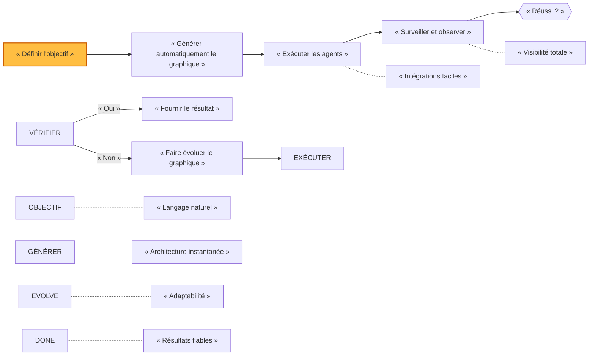

<p align="center">
  
</p>

<p align="center">
  <a href="../../README.md">English</a> |
  <a href="zh-CN.md">简体中文</a> |
  <a href="es.md">Español</a> |
  <a href="pt.md">Português</a> |
  <a href="ja.md">日本語</a> |
  <a href="ru.md">Русский</a> |
  <a href="ko.md">한국어</a>
  <a href="hi.md">हिंदी</a>
  <a href="fr.md">Français</a> 
</p>

<p align="center">
  <a href="https://github.com/adenhq/hive/blob/main/LICENSE"></a>
  <a href="https://www.ycombinator.com/companies/aden"></a>
  <a href="https://discord.com/invite/MXE49hrKDk"></a>
  <a href="https://x.com/aden_hq"></a>
  <a href="https://www.linkedin.com/company/teamaden/"></a>
  
</p>

<p align="center">
  
  
  
  
  
</p>
<p align="center">
  
  
  
</p>

## Présentation

Créez des agents IA autonomes, fiables et capables de s'améliorer sans avoir à coder en dur les workflows. Définissez votre objectif en dialoguant avec un agent de codage, et le framework génère un graphe de nœuds avec un code de connexion créé dynamiquement. En cas de dysfonctionnement, le framework capture les données d'échec, fait évoluer l'agent via l'agent de codage et le redéploie. Les nœuds intégrés « human-in-the-loop », la gestion des identifiants et la surveillance en temps réel vous permettent de garder le contrôle sans sacrifier l'adaptabilité.

Rendez-vous sur [adenhq.com](https://adenhq.com) pour consulter la documentation complète, des exemples et des guides.

https://github.com/user-attachments/assets/846c0cc7-ffd6-47fa-b4b7-495494857a55

## À qui s'adresse Hive ?

Hive est conçu pour les développeurs et les équipes qui souhaitent créer des **agents IA de niveau production** sans avoir à câbler manuellement des workflows complexes.

Hive est la solution idéale si vous :

- Souhaitez disposer d'agents IA qui **exécutent de véritables processus métier**, et non des démonstrations
- Préférez le **développement axé sur les objectifs** aux workflows codés en dur
- Avez besoin d'**agents auto-réparateurs et adaptatifs** qui s'améliorent au fil du temps
- Vous avez besoin d'un **contrôle humain en boucle**, d'observabilité et de limites de coûts
- Vous prévoyez d'exécuter des agents dans des **environnements de production**

Hive n'est peut-être pas la solution la plus adaptée si vous ne faites qu'expérimenter des chaînes d'agents simples ou des scripts ponctuels.

## Quand utiliser Hive ?

Utilisez Hive lorsque vous avez besoin :

- d'agents autonomes fonctionnant en continu ;
- de garde-fous, de processus et de contrôles solides ;
- d'une amélioration continue basée sur les échecs ;
- d'une coordination multi-agents ;
- d'un cadre qui évolue avec vos objectifs.

## Liens rapides

- **[Documentation](https://docs.adenhq.com/)** - Guides complets et référence API
- **[Guide d'auto-hébergement](https://docs.adenhq.com/getting-started/quickstart)** - Déployez Hive sur votre infrastructure
- **[Journal des modifications](https://github.com/adenhq/hive/releases)** - Dernières mises à jour et versions
- **[Feuille de route](docs/roadmap.md)** - Fonctionnalités et projets à venir
- **[Signaler des problèmes](https://github.com/adenhq/hive/issues)** - Rapports de bogues et demandes de fonctionnalités
- **[Contribuer](CONTRIBUTING.md)** - Comment contribuer et soumettre des PR

## Démarrage rapide

### Prérequis

- Python 3.11+ pour le développement d'agents
- Claude Code ou Cursor pour utiliser les compétences des agents

> **Remarque pour les utilisateurs Windows :** il est fortement recommandé d'utiliser **WSL (Windows Subsystem for Linux)** ou **Git Bash** pour exécuter ce framework. Certains scripts d'automatisation essentiels peuvent ne pas s'exécuter correctement dans l'invite de commande standard ou PowerShell.

### Installation

```bash
# Cloner le référentiel
git clone https://github.com/adenhq/hive.git
cd hive

# Exécuter la configuration rapide
./quickstart.sh
```

Cela configure :

- **framework** - Runtime de l'agent principal et exécuteur de graphiques (dans `core/.venv`)
- **aden_tools** - Outils MCP pour les capacités de l'agent (dans `tools/.venv`)
- **stockage des informations d'identification** - Stockage crypté des clés API (`~/.hive/credentials`)
- **fournisseur LLM** - Configuration interactive du modèle par défaut
- Toutes les dépendances Python requises avec `uv`

### Créez votre premier agent

```bash
# Créez un agent à l'aide de Claude Code
claude> /hive

# Testez votre agent
claude> /hive-debugger

# (dans un terminal séparé) Lancez le tableau de bord interactif
hive tui

# Ou exécutez directement
hive run exports/your_agent_name --input “{« key »: « value »}”
```

## Prise en charge des agents de codage

### Opencode

Hive inclut une prise en charge native d'[Opencode](https://github.com/opencode-ai/opencode).

1. **Configuration :** exécutez le script de démarrage rapide
2. **Lancement :** ouvrez Opencode à la racine du projet.
3. **Activation :** tapez `/hive` dans le chat pour passer à l'agent Hive.
4. **Vérification :** demandez à l'agent _« Listez vos outils »_ pour confirmer la connexion.

L'agent a accès à toutes les compétences Hive et peut créer des agents, ajouter des outils et déboguer des workflows directement depuis le chat.

**[📖 Guide d'installation complet](docs/environment-setup.md)** - Instructions détaillées pour le développement d'agents

### Prise en charge d'Antigravity IDE

Les compétences et les serveurs MCP sont également disponibles dans [Antigravity IDE](https://antigravity.google/) (l'IDE alimenté par l'IA de Google). **Le plus simple :** ouvrez un terminal dans le dossier du dépôt hive et exécutez (utilisez `./` — le script se trouve dans le dépôt) :

```bash
./scripts/setup-antigravity-mcp.sh
```

**Important :** redémarrez/actualisez toujours Antigravity IDE après avoir exécuté le script d'installation — les serveurs MCP ne se chargent qu'au démarrage. Après le redémarrage, les serveurs MCP **agent-builder** et **tools** devraient se connecter. Les compétences se trouvent sous `.agent/skills/` (liens symboliques vers `.claude/skills/`). Consultez [docs/antigravity-setup.md](docs/antigravity-setup.md) pour la configuration manuelle et le dépannage.

## Fonctionnalités

- **[Développement axé sur les objectifs](docs/key_concepts/goals_outcome.md)** - Définissez des objectifs en langage naturel ; l'agent de codage génère le graphe d'agent et le code de connexion pour les atteindre
- **[Adaptabilité](docs/key_concepts/evolution.md)** - Le framework capture les échecs, effectue des calibrages en fonction des objectifs et fait évoluer le graphe d'agent
- **[Connexions dynamiques entre les nœuds](docs/key_concepts/graph.md)** - Pas de liens prédéfinis ; le code de connexion est généré par n'importe quel LLM capable en fonction de vos objectifs
- **Nœuds encapsulés dans un SDK** - Chaque nœud dispose d'une mémoire partagée, d'une mémoire RLM locale, d'outils de surveillance et d'un accès LLM prêts à l'emploi
- **[Human-in-the-Loop](docs/key_concepts/graph.md#human-in-the-loop)** - Nœuds d'intervention qui suspendent l'exécution pour permettre une intervention humaine avec des délais d'attente et des escalades configurables
- **Observabilité en temps réel** - Streaming WebSocket pour la surveillance en direct de l'exécution des agents, des décisions et de la communication entre les nœuds
- **Tableau de bord TUI interactif** - Tableau de bord basé sur un terminal avec affichage graphique en direct, journal des événements et interface de chat pour l'interaction avec les agents
- **Contrôle des coûts et du budget** - Définissez des limites de dépenses, des restrictions et des politiques de dégradation automatique des modèles
- **Prêt pour la production** - Auto-hébergeable, conçu pour l'évolutivité et la fiabilité

## Intégration

<a href="https://github.com/adenhq/hive/tree/main/tools/src/aden_tools/tools"></a>

Hive est conçu pour être indépendant des modèles et des systèmes.

- **Flexibilité LLM** - Le framework Hive est conçu pour prendre en charge différents types de LLM, y compris les modèles hébergés et locaux via des fournisseurs compatibles LiteLLM.
- **Connectivité aux systèmes d'entreprise** - Le framework Hive est conçu pour se connecter à tous types de systèmes d'entreprise en tant qu'outils, tels que les CRM, les services d'assistance, la messagerie, les données, les fichiers et les API internes via MCP.

## Pourquoi Aden

Hive se concentre sur la génération d'agents qui exécutent des processus métier réels plutôt que des agents génériques. Au lieu de vous obliger à concevoir manuellement des workflows, à définir les interactions des agents et à gérer les échecs de manière réactive, Hive renverse le paradigme : **vous décrivez les résultats, et le système se construit tout seul**, offrant une expérience adaptative axée sur les résultats avec un ensemble d'outils et d'intégrations faciles à utiliser.



### L'avantage Hive

| Cadres traditionnels                  | Hive                                         |
| ------------------------------------- | -------------------------------------------- |
| Workflows d'agents codés en dur       | Description des objectifs en langage naturel |
| Définition manuelle des graphiques    | Graphiques d'agents générés automatiquement  |
| Gestion réactive des erreurs          | Évaluation des résultats et adaptabilité     |
| Configurations statiques des outils   | Nœuds dynamiques encapsulés dans un SDK      |
| Configuration de surveillance séparée | Observabilité en temps réel intégrée         |
| Gestion du budget DIY                 | Contrôles des coûts et dégradation intégrés  |

### Comment ça marche

1. **[Définissez votre objectif](docs/key_concepts/goals_outcome.md)** → Décrivez ce que vous souhaitez accomplir en langage clair
2. **Génération par l'agent de codage** → Crée le [graphique de l'agent](docs/key_concepts/graph.md), le code de connexion et les cas de test
3. **[Exécution par les travailleurs](docs/key_concepts/worker_agent.md)** → Les nœuds encapsulés par le SDK s'exécutent avec une observabilité totale et un accès complet aux outils
4. **Le plan de contrôle surveille** → Mesures en temps réel, application du budget, gestion des politiques
5. **[Adaptabilité](docs/key_concepts/evolution.md)** → En cas d'échec, le système fait évoluer le graphique et se redéploie automatiquement

## Exécuter des agents

L'interface CLI `hive` est l'interface principale pour exécuter des agents.

```bash
# Parcourir et exécuter les agents de manière interactive (recommandé)
hive tui

# Exécuter directement un agent spécifique
hive run exports/my_agent --input “{« task »: « Votre entrée ici »}”

# Exécuter un agent spécifique avec le tableau de bord TUI
hive run exports/my_agent --tui

# REPL interactif
hive shell
```

Le TUI analyse à la fois `exports/` et `examples/templates/` pour trouver les agents disponibles.

> **Utilisation directe de Python (alternative) :** vous pouvez également exécuter des agents avec `PYTHONPATH=exports uv run python -m agent_name run --input “{...}”`

Consultez [environment-setup.md](docs/environment-setup.md) pour obtenir des instructions de configuration complètes.

## Documentation

- **[Guide du développeur](docs/developer-guide.md)** - Guide complet pour les développeurs
- [Pour commencer](docs/getting-started.md) - Instructions de configuration rapide
- [Guide TUI](docs/tui-selection-guide.md) - Utilisation du tableau de bord interactif
- [Guide de configuration](docs/configuration.md) - Toutes les options de configuration
- [Présentation de l'architecture](docs/architecture/README.md) - Conception et structure du système

## Feuille de route

Aden Hive Agent Framework vise à aider les développeurs à créer des agents auto-adaptatifs axés sur les résultats. Pour plus de détails, consultez [roadmap.md](docs/roadmap.md).

```mermaid
flowchart TD
subgraph Foundation
    direction LR
    subgraph arch[« Architecture »]
        a1[« Node-Based Architecture »]:::done
        a2[« Python SDK »]:::done
        a3[« LLM Integration »]:::done
        a4[« Communication Protocol »]:::done
    end
    sous-graphique ca[« Agent de codage »]
        b1[« Session de création d'objectifs »]:::terminé
        b2[« Création d'agents travailleurs »]
        b3[« Outils MCP »]:::terminé
    end
    sous-graphique wa[« Agent travailleur »]
        c1[« Human-in-the-Loop »]:::terminé
        c2[« Gestionnaires de rappel »]:::terminé
        c3[« Points d'intervention »]:::terminé
        c4[« Interface de streaming »]
fin
sous-graphe cred[« Identifiants »]
d1[« Processus de configuration »]:::terminé
d2[« Sources enfichables »]:::terminé
d3[« Secrets d'entreprise »]
        d4[« Outils d'intégration »]:::terminé
    fin
    sous-graphique outils[« Outils »]
        e1[« Utilisation des fichiers »]:::terminé
        e2[« Mémoire STM/LTM »]:::terminé
        e3[« Recherche Web/Scraper »]:::terminé
        e4[« CSV/PDF »]:::terminé
        e5[« Excel/Email »]
    end
    sous-graphique core[« Core »]
        f1[« Système d'évaluation »]
        f2[« Validation Pydantic »]:::done
        f3[« Documentation »]:::done
        f4[« Adaptabilité »]
        f5[« Exemples d'agents »]
    end
end

sous-graphe Expansion
    direction LR
    sous-graphe intel[« Intelligence »]
        g1[« Guardrails »]
        g2[« Streaming Mode »]
        g3[« Image Generation »]
        g4[« Semantic Search »]
    fin
    sous-graphe mem[« Itération de mémoire »]
        h1[« Modèle de message et sessions »]
        h2[« Migration de stockage »]
        h3[« Construction de contexte »]
        h4[« Compactage proactif »]
        h5[« Suivi des jetons »]
    fin
    sous-graphe evt[« Système d'événements »]
        i1[« Bus d'événements pour les nœuds »]
    fin
    sous-graphique cas[« Assistance agent de codage »]
        j1[« Claude Code »]
        j2[« Curseur »]
        j3[« Opencode »]
        j4[« Antigravité »]
    fin
    sous-graphique plat[« Plateforme »]
        k1[« SDK JavaScript/TypeScript »]
        k2[« Intégrateur d'outils personnalisés »]
        k3[« Prise en charge Windows »]
    fin
    sous-graphe dep[« Déploiement »]
        l1[« Auto-hébergé »]
        l2[« Services cloud »]
        l3[« Pipeline CI/CD »]
    fin
    sous-graphe tmpl[« Modèles »]
        m1[« Agent commercial »]
        m2[« Agent marketing »]
        m3[« Agent d'analyse »]
        m4[« Agent de formation »]
        m5[« Agent de formulaire intelligent »]
    end
end

classDef done fill:#9e9e9e,color:#fff,stroke:#757575
```

## Contribuer

Nous apprécions les contributions de la communauté ! Nous recherchons particulièrement de l'aide pour créer des outils, des intégrations et des exemples d'agents pour le framework ([voir #2805](https://github.com/adenhq/hive/issues/2805)). Si vous souhaitez étendre ses fonctionnalités, c'est le point de départ idéal. Veuillez consulter [CONTRIBUTING.md](CONTRIBUTING.md) pour connaître les directives.

**Important :** veuillez vous voir attribuer un ticket avant de soumettre une demande de tirage. Commentez un ticket pour le réclamer, et un responsable vous l'attribuera. Les tickets comportant des étapes reproductibles et des propositions sont traités en priorité. Cela permet d'éviter les doublons.

1. Trouvez ou créez un ticket et faites-vous assigner.
2. Fork le dépôt.
3. Créez votre branche de fonctionnalité (`git checkout -b feature/amazing-feature`).
4. Validez vos modifications (`git commit -m “Add amazing feature”`).
5. Poussez vers la branche (`git push origin feature/amazing-feature`).
6. Ouvrez une demande de pull

## Communauté et assistance

Nous utilisons [Discord](https://discord.com/invite/MXE49hrKDk) pour l'assistance, les demandes de fonctionnalités et les discussions communautaires.

- Discord - [Rejoignez notre communauté](https://discord.com/invite/MXE49hrKDk)
- Twitter/X - [@adenhq](https://x.com/aden_hq)
- LinkedIn - [Page de l'entreprise](https://www.linkedin.com/company/teamaden/)

## Rejoignez notre équipe

**Nous recrutons !** Rejoignez-nous dans les domaines de l'ingénierie, de la recherche et de la commercialisation.

[Consultez les postes à pourvoir](https://jobs.adenhq.com/a8cec478-cdbc-473c-bbd4-f4b7027ec193/applicant)

## Sécurité

Pour les questions de sécurité, veuillez consulter [SECURITY.md](SECURITY.md).

## Licence

Ce projet est sous licence Apache License 2.0 - voir le fichier [LICENSE](LICENSE) pour plus de détails.

## Foire aux questions (FAQ)

**Q : Quels fournisseurs LLM Hive prend-il en charge ?**

Hive prend en charge plus de 100 fournisseurs LLM grâce à l'intégration LiteLLM, notamment OpenAI (GPT-4, GPT-4o), Anthropic (modèles Claude), Google Gemini, DeepSeek, Mistral, Groq et bien d'autres. Il suffit de définir la variable d'environnement de clé API appropriée et de spécifier le nom du modèle.

**Q : Puis-je utiliser Hive avec des modèles d'IA locaux tels que Ollama ?**

Oui ! Hive prend en charge les modèles locaux grâce à LiteLLM. Il suffit d'utiliser le format de nom de modèle « ollama/nom-du-modèle » (par exemple, « ollama/llama3 », « ollama/mistral ») et de s'assurer qu'Ollama fonctionne localement.

**Q : En quoi Hive se distingue-t-il des autres frameworks d'agents ?**

Hive génère l'intégralité de votre système d'agents à partir d'objectifs en langage naturel à l'aide d'un agent de codage. Vous n'avez pas besoin de coder en dur les workflows ni de définir manuellement les graphiques. Lorsque les agents échouent, le framework capture automatiquement les données d'échec, [fait évoluer le graphique de l'agent](docs/key_concepts/evolution.md) et le redéploie. Cette boucle d'auto-amélioration est unique à Aden.

**Q : Hive est-il open source ?**

Oui, Hive est entièrement open source sous licence Apache 2.0. Nous encourageons activement les contributions et la collaboration de la communauté.

**Q : Hive peut-il gérer des cas d'utilisation complexes à l'échelle de la production ?**

Oui. Hive est explicitement conçu pour les environnements de production avec des fonctionnalités telles que la récupération automatique en cas de panne, l'observabilité en temps réel, le contrôle des coûts et la prise en charge de la mise à l'échelle horizontale. Le framework gère à la fois les automatisations simples et les workflows multi-agents complexes.

**Q : Hive prend-il en charge les workflows avec intervention humaine ?**

Oui, Hive prend entièrement en charge les workflows avec intervention humaine grâce à des nœuds d'intervention qui suspendent l'exécution pour permettre une intervention humaine. Ceux-ci incluent des délais d'attente et des politiques d'escalade configurables, permettant une collaboration transparente entre les experts humains et les agents IA.

**Q : Quels langages de programmation Hive prend-il en charge ?**

Le framework Hive est développé en Python. Un SDK JavaScript/TypeScript est en cours de développement.

**Q : Les agents Hive peuvent-ils interagir avec des outils externes et des API ?**

Oui. Les nœuds encapsulés dans le SDK d'Aden fournissent un accès intégré aux outils, et le framework prend en charge des écosystèmes d'outils flexibles. Les agents peuvent s'intégrer à des API, des bases de données et des services externes via l'architecture des nœuds.

**Q : Comment fonctionne le contrôle des coûts dans Hive ?**

Hive offre des contrôles budgétaires granulaires, notamment des limites de dépenses, des restrictions et des politiques de dégradation automatique des modèles. Vous pouvez définir des budgets au niveau de l'équipe, de l'agent ou du flux de travail, avec un suivi des coûts et des alertes en temps réel.

**Q : Où puis-je trouver des exemples et de la documentation ?**

Rendez-vous sur [docs.adenhq.com](https://docs.adenhq.com/) pour obtenir des guides complets, des références API et des tutoriels de démarrage. Le référentiel comprend également de la documentation dans le dossier « docs/ » et un [guide complet pour les développeurs](docs/developer-guide.md).

**Q : Comment puis-je contribuer à Aden ?**

Les contributions sont les bienvenues ! Créez une fourche du référentiel, créez votre branche de fonctionnalités, implémentez vos modifications et soumettez une demande d'extraction. Consultez [CONTRIBUTING.md](CONTRIBUTING.md) pour obtenir des instructions détaillées.

**Q : Quand mon équipe commencera-t-elle à voir les résultats des agents adaptatifs d'Aden ?**

La boucle d'adaptation d'Aden commence à fonctionner dès la première exécution. Lorsqu'un agent échoue, le framework capture les données d'échec, aidant les développeurs à faire évoluer le graphe de l'agent grâce à l'agent de codage. La rapidité avec laquelle cela se traduit par des résultats mesurables dépend de la complexité de votre cas d'utilisation, de la qualité de vos définitions d'objectifs et du volume d'exécutions générant des commentaires.

**Q : En quoi Hive se distingue-t-il des autres frameworks d'agents ?**

Hive se concentre sur la génération d'agents qui exécutent des processus métier réels, plutôt que sur des agents génériques. Cette vision met l'accent sur une conception axée sur les résultats, l'adaptabilité et un ensemble d'outils et d'intégrations faciles à utiliser.

---

<p align="center">
  Conçu avec 🔥 Passion à San Francisco
</p>
