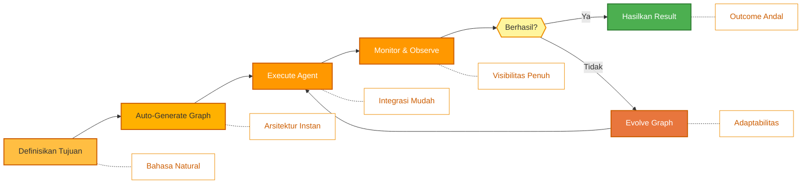
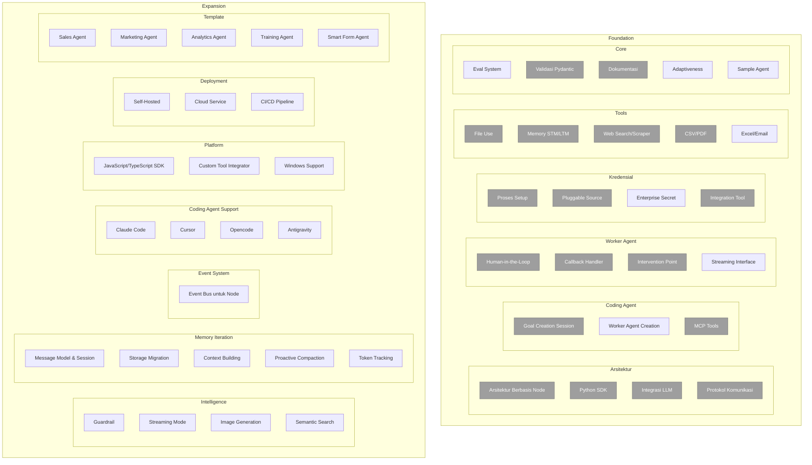

<p align="center">
  
</p>

<p align="center">
  <a href="../../README.md">English</a> |
  <a href="zh-CN.md">简体中文</a> |
  <a href="es.md">Español</a> |
  <a href="hi.md">हिन्दी</a> |
  <a href="pt.md">Português</a> |
  <a href="ja.md">日本語</a> |
  <a href="ru.md">Русский</a> |
  <a href="ko.md">한국어</a> |
  <a href="id.md">Bahasa Indonesia</a>
</p>

<p align="center">
  <a href="https://github.com/adenhq/hive/blob/main/LICENSE"></a>
  <a href="https://www.ycombinator.com/companies/aden"></a>
  <a href="https://discord.com/invite/MXE49hrKDk"></a>
  <a href="https://x.com/aden_hq"></a>
  <a href="https://www.linkedin.com/company/teamaden/"></a>
  
</p>


<p align="center">
  
  
  
  
  
</p>
<p align="center">
  
  
  
</p>

## Ringkasan

Bangun AI agent yang otonom, andal, dan terus berkembang tanpa hardcoding workflow. Definisikan tujuan Anda melalui percakapan dengan coding agent, dan framework akan menghasilkan node graph dengan connection code yang dibuat secara dinamis. Ketika terjadi masalah, framework menangkap data kegagalan, mengembangkan agent melalui coding agent, dan melakukan redeploy. Dilengkapi dengan node human-in-the-loop, manajemen kredensial, dan monitoring real-time yang memberikan kontrol tanpa mengorbankan adaptabilitas.

Kunjungi [adenhq.com](https://adenhq.com) untuk dokumentasi lengkap, contoh, dan panduan.

https://github.com/user-attachments/assets/846c0cc7-ffd6-47fa-b4b7-495494857a55

## Untuk Siapa Hive?

Hive dirancang untuk developer dan tim yang ingin membangun **AI agent production-grade** tanpa perlu menyusun workflow kompleks secara manual.

Hive cocok untuk Anda jika:

- Menginginkan AI agent yang **menjalankan proses bisnis nyata**, bukan sekadar demo
- Lebih suka **pengembangan berbasis tujuan** daripada hardcoded workflow
- Membutuhkan **agent yang self-healing dan adaptif** yang terus berkembang
- Memerlukan **kontrol human-in-the-loop**, observabilitas, dan batas biaya
- Berencana menjalankan agent di **lingkungan production**

Hive mungkin kurang cocok jika Anda hanya bereksperimen dengan agent chain sederhana atau script sekali pakai.

## Kapan Harus Menggunakan Hive?

Gunakan Hive ketika Anda membutuhkan:

- Agent otonom yang berjalan lama
- Guardrail yang kuat, proses, dan kontrol
- Continuous improvement berdasarkan kegagalan
- Koordinasi multi-agent
- Framework yang berkembang sesuai tujuan Anda

## Tautan Cepat

- **[Dokumentasi](https://docs.adenhq.com/)** - Panduan lengkap dan referensi API
- **[Panduan Self-Hosting](https://docs.adenhq.com/getting-started/quickstart)** - Deploy Hive di infrastruktur Anda
- **[Changelog](https://github.com/adenhq/hive/releases)** - Update dan rilis terbaru
- **[Roadmap](../roadmap.md)** - Fitur dan rencana mendatang
- **[Laporkan Masalah](https://github.com/adenhq/hive/issues)** - Bug report dan feature request

## Mulai Cepat

### Prasyarat

- Python 3.11+ untuk pengembangan agent
- Claude Code atau Cursor untuk memanfaatkan agent skills

> **Catatan untuk Pengguna Windows:** Sangat direkomendasikan menggunakan **WSL (Windows Subsystem for Linux)** atau **Git Bash** untuk menjalankan framework ini. Beberapa automation script mungkin tidak berjalan dengan benar di Command Prompt atau PowerShell standar.

### Instalasi

```bash
# Clone repository
git clone https://github.com/adenhq/hive.git
cd hive

# Jalankan quickstart setup
./quickstart.sh
```

Ini akan setup:

- **framework** - Core agent runtime dan graph executor (di `core/.venv`)
- **aden_tools** - MCP tools untuk kapabilitas agent (di `tools/.venv`)
- **credential store** - Penyimpanan API key terenkripsi (`~/.hive/credentials`)
- **LLM provider** - Konfigurasi model default secara interaktif
- Semua dependency Python yang diperlukan dengan `uv`

### Bangun Agent Pertama Anda

```bash
# Bangun agent menggunakan Claude Code
claude> /hive

# Test agent Anda
claude> /hive-debugger

# (di terminal terpisah) Luncurkan dashboard interaktif
hive tui

# Atau jalankan langsung
hive run exports/your_agent_name --input '{"key": "value"}'
```

## Dukungan Coding Agent
### Opencode 
Hive menyertakan dukungan native untuk [Opencode](https://github.com/opencode-ai/opencode).

1. **Setup:** Jalankan script quickstart 
2. **Launch:** Buka Opencode di root project.
3. **Activate:** Ketik `/hive` di chat untuk beralih ke Hive Agent.
4. **Verify:** Minta agent *"List your tools"* untuk mengonfirmasi koneksi.

Agent memiliki akses ke semua skill Hive dan dapat melakukan scaffold agent, menambahkan tool, dan debug workflow secara langsung dari chat.

**[📖 Panduan Setup Lengkap](../environment-setup.md)** - Instruksi detail untuk pengembangan agent

## Fitur

- **[Goal-Driven Development](../key_concepts/goals_outcome.md)** - Definisikan objective dalam bahasa natural; coding agent menghasilkan agent graph dan connection code untuk mencapainya
- **[Adaptiveness](../key_concepts/evolution.md)** - Framework menangkap kegagalan, kalibrasi sesuai objective, dan mengembangkan agent graph
- **[Dynamic Node Connections](../key_concepts/graph.md)** - Tidak ada edge yang telah didefinisikan; connection code dihasilkan oleh LLM yang capable berdasarkan tujuan Anda
- **SDK-Wrapped Nodes** - Setiap node mendapat shared memory, local RLM memory, monitoring, tools, dan akses LLM secara otomatis
- **[Human-in-the-Loop](../key_concepts/graph.md#human-in-the-loop)** - Intervention node yang menjeda eksekusi untuk input manusia dengan timeout yang dapat dikonfigurasi dan kebijakan eskalasi
- **Real-time Observability** - WebSocket streaming untuk monitoring live terhadap eksekusi agent, keputusan, dan komunikasi node-to-node
- **Interactive TUI Dashboard** - Dashboard berbasis terminal dengan tampilan graph live, event log, dan chat interface untuk interaksi agent
- **Cost & Budget Control** - Atur spending limit, throttle, dan kebijakan degradasi model otomatis
- **Production-Ready** - Self-hostable, dibangun untuk skala dan reliabilitas

## Integrasi

<a href="https://github.com/adenhq/hive/tree/main/tools/src/aden_tools/tools"></a>

Hive dibangun untuk model-agnostic dan system-agnostic.

- **Fleksibilitas LLM** - Hive Framework dirancang untuk mendukung berbagai jenis LLM, termasuk hosted dan local model melalui LiteLLM-compatible provider.
- **Konektivitas sistem bisnis** - Hive Framework dirancang untuk terhubung ke semua jenis sistem bisnis sebagai tools, seperti CRM, support, messaging, data, file, dan internal API via MCP.


## Mengapa Aden

Hive berfokus pada pembuatan agent yang menjalankan proses bisnis nyata daripada agent generik. Alih-alih mengharuskan Anda merancang workflow secara manual, mendefinisikan interaksi agent, dan menangani kegagalan secara reaktif, Hive membalik paradigma: **Anda mendeskripsikan outcome, dan sistem membangun dirinya sendiri**—memberikan pengalaman outcome-driven yang adaptif dengan set tool dan integrasi yang mudah digunakan.



### Keunggulan Hive

| Framework Tradisional       | Hive                                         |
| --------------------------- | -------------------------------------------- |
| Hardcode agent workflow     | Deskripsikan tujuan dalam bahasa natural     |
| Definisi graph manual       | Agent graph yang di-generate otomatis        |
| Error handling reaktif      | Evaluasi outcome dan adaptiveness            |
| Konfigurasi tool statis     | Dynamic SDK-wrapped node                     |
| Setup monitoring terpisah   | Built-in real-time observability             |
| Manajemen budget DIY        | Cost control & degradasi terintegrasi        |

### Cara Kerjanya

1. **[Definisikan Tujuan Anda](../key_concepts/goals_outcome.md)** → Deskripsikan apa yang ingin Anda capai dalam bahasa Indonesia biasa
2. **Coding Agent Generate** → Membuat [agent graph](../key_concepts/graph.md), connection code, dan test case
3. **[Worker Execute](../key_concepts/worker_agent.md)** → SDK-wrapped node berjalan dengan observabilitas penuh dan akses tool
4. **Control Plane Monitor** → Metrik real-time, budget enforcement, policy management
5. **[Adaptiveness](../key_concepts/evolution.md)** → Saat gagal, sistem mengembangkan graph dan redeploy otomatis

## Menjalankan Agent

CLI `hive` adalah interface utama untuk menjalankan agent.

```bash
# Browse dan jalankan agent secara interaktif (Direkomendasikan)
hive tui

# Jalankan agent tertentu langsung
hive run exports/my_agent --input '{"task": "Input Anda di sini"}'

# Jalankan agent tertentu dengan TUI dashboard
hive run exports/my_agent --tui

# Interactive REPL
hive shell
```

TUI memindai `exports/` dan `examples/templates/` untuk agent yang tersedia.

> **Menggunakan Python langsung (alternatif):** Anda juga dapat menjalankan agent dengan `PYTHONPATH=exports uv run python -m agent_name run --input '{...}'`

Lihat [environment-setup.md](../environment-setup.md) untuk instruksi setup lengkap.

## Dokumentasi

- **[Developer Guide](../developer-guide.md)** - Panduan komprehensif untuk developer
- [Getting Started](../getting-started.md) - Instruksi setup cepat
- [TUI Guide](../tui-selection-guide.md) - Penggunaan dashboard interaktif
- [Configuration Guide](../configuration.md) - Semua opsi konfigurasi
- [Architecture Overview](../architecture/README.md) - Desain dan struktur sistem

## Roadmap

Aden Hive Agent Framework bertujuan membantu developer membangun agent yang outcome-oriented dan self-adaptive. Lihat [roadmap.md](../roadmap.md) untuk detail.



## Kontribusi

Kami menyambut kontribusi dari komunitas! Kami terutama mencari bantuan untuk membangun tool, integrasi, dan contoh agent untuk framework ini ([cek #2805](https://github.com/adenhq/hive/issues/2805)). Jika Anda tertarik untuk memperluas fungsionalitasnya, ini adalah tempat yang tepat untuk memulai. Silakan lihat [CONTRIBUTING.md](../../CONTRIBUTING.md) untuk panduan.

**Penting:** Harap dapatkan assignment ke issue sebelum submit PR. Comment pada issue untuk claim, dan maintainer akan assign Anda. Issue dengan reproducible step dan proposal diprioritaskan. Ini membantu mencegah duplikasi pekerjaan.

1. Temukan atau buat issue dan dapatkan assignment
2. Fork repository
3. Buat feature branch Anda (`git checkout -b feature/fitur-keren`)
4. Commit perubahan Anda (`git commit -m 'Tambah fitur keren'`)
5. Push ke branch (`git push origin feature/fitur-keren`)
6. Buka Pull Request

## Komunitas & Dukungan

Kami menggunakan [Discord](https://discord.com/invite/MXE49hrKDk) untuk dukungan, feature request, dan diskusi komunitas.

- Discord - [Bergabung dengan komunitas kami](https://discord.com/invite/MXE49hrKDk)
- Twitter/X - [@adenhq](https://x.com/aden_hq)
- LinkedIn - [Company Page](https://www.linkedin.com/company/teamaden/)

## Bergabung dengan Tim Kami

**Kami sedang merekrut!** Bergabunglah dengan kami di posisi engineering, research, dan go-to-market.

[Lihat Posisi Terbuka](https://jobs.adenhq.com/a8cec478-cdbc-473c-bbd4-f4b7027ec193/applicant)

## Keamanan

Untuk masalah keamanan, silakan lihat [SECURITY.md](../../SECURITY.md).

## Lisensi

Proyek ini dilisensikan di bawah Apache License 2.0 - lihat file [LICENSE](../../LICENSE) untuk detail.

## Pertanyaan yang Sering Diajukan (FAQ)

**T: LLM provider apa saja yang didukung Hive?**

Hive mendukung 100+ LLM provider melalui integrasi LiteLLM, termasuk OpenAI (GPT-4, GPT-4o), Anthropic (model Claude), Google Gemini, DeepSeek, Mistral, Groq, dan banyak lagi. Cukup set environment variable API key yang sesuai dan tentukan nama model.

**T: Bisakah saya menggunakan Hive dengan model AI lokal seperti Ollama?**

Ya! Hive mendukung model lokal melalui LiteLLM. Cukup gunakan format nama model `ollama/nama-model` (misal `ollama/llama3`, `ollama/mistral`) dan pastikan Ollama berjalan secara lokal.

**T: Apa yang membuat Hive berbeda dari framework agent lain?**

Hive menghasilkan seluruh sistem agent Anda dari tujuan bahasa natural menggunakan coding agent—Anda tidak perlu hardcode workflow atau mendefinisikan graph secara manual. Ketika agent gagal, framework secara otomatis menangkap data kegagalan, [mengembangkan agent graph](../key_concepts/evolution.md), dan redeploy. Loop self-improving ini unik untuk Aden.

**T: Apakah Hive open-source?**

Ya, Hive sepenuhnya open-source di bawah Apache License 2.0. Kami secara aktif mendorong kontribusi dan kolaborasi komunitas.

**T: Bisakah Hive menangani use case yang kompleks dan skala production?**

Ya. Hive secara eksplisit dirancang untuk lingkungan production dengan fitur seperti automatic failure recovery, real-time observability, cost control, dan dukungan horizontal scaling. Framework menangani automasi sederhana maupun workflow multi-agent yang kompleks.

**T: Apakah Hive mendukung workflow human-in-the-loop?**

Ya, Hive sepenuhnya mendukung workflow [human-in-the-loop](../key_concepts/graph.md#human-in-the-loop) melalui intervention node yang menjeda eksekusi untuk input manusia. Ini termasuk timeout yang dapat dikonfigurasi dan kebijakan eskalasi, memungkinkan kolaborasi seamless antara expert manusia dan AI agent.

**T: Bahasa pemrograman apa yang didukung Hive?**

Hive framework dibangun dengan Python. SDK JavaScript/TypeScript ada di roadmap.

**T: Bisakah agent Hive berinteraksi dengan tool dan API eksternal?**

Ya. SDK-wrapped node Aden menyediakan akses tool built-in, dan framework mendukung ekosistem tool yang fleksibel. Agent dapat terintegrasi dengan API eksternal, database, dan service melalui arsitektur node.

**T: Bagaimana cost control bekerja di Hive?**

Hive menyediakan budget control granular termasuk spending limit, throttle, dan kebijakan degradasi model otomatis. Anda dapat mengatur budget di level tim, agent, atau workflow, dengan real-time cost tracking dan alert.

**T: Di mana saya bisa menemukan contoh dan dokumentasi?**

Kunjungi [docs.adenhq.com](https://docs.adenhq.com/) untuk panduan lengkap, referensi API, dan tutorial getting started. Repository juga menyertakan dokumentasi di folder `docs/` dan [developer guide](../developer-guide.md) yang komprehensif.

**T: Bagaimana cara saya berkontribusi ke Aden?**

Kontribusi sangat diterima! Fork repository, buat feature branch Anda, implementasikan perubahan Anda, dan submit pull request. Lihat [CONTRIBUTING.md](../../CONTRIBUTING.md) untuk panduan detail.

**T: Kapan tim saya akan mulai melihat hasil dari agent adaptif Aden?**

Loop adaptasi Aden mulai bekerja dari eksekusi pertama. Ketika agent gagal, framework menangkap data kegagalan, membantu developer mengembangkan agent graph melalui coding agent. Seberapa cepat ini diterjemahkan ke hasil yang terukur tergantung pada kompleksitas use case Anda, kualitas definisi tujuan Anda, dan volume eksekusi yang menghasilkan feedback.

**T: Bagaimana Hive dibandingkan dengan framework agent lain?**

Hive berfokus pada pembuatan agent yang menjalankan proses bisnis nyata, daripada agent generik. Visi ini menekankan desain outcome-driven, adaptabilitas, dan set tool serta integrasi yang mudah digunakan.

---

<p align="center">
  Dibuat dengan 🔥 Passion di San Francisco
</p>
