<p align="center">
  
</p>

<p align="center">
  <a href="../../README.md">English</a> |
  <a href="zh-CN.md">简体中文</a> |
  <a href="es.md">Español</a> |
  <a href="pt.md">Português</a> |
  <a href="ja.md">日本語</a> |
  <a href="ru.md">Русский</a> |
  <a href="ko.md">한국어</a> |
  <a href="id.md">Bahasa Indonesia</a>
</p>

[](https://github.com/adenhq/hive/blob/main/LICENSE)
[](https://www.ycombinator.com/companies/aden)
[](https://hub.docker.com/u/adenhq)
[](https://discord.com/invite/MXE49hrKDk)
[](https://x.com/aden_hq)
[](https://www.linkedin.com/company/teamaden/)

<p align="center">
  
  
  
  
  
</p>
<p align="center">
  
  
  
  
</p>

## Ringkasan

Bangun agen AI yang handal dan dapat memperbaiki diri sendiri tanpa perlu mengkode alur kerja secara hardcode. Definisikan tujuan Anda melalui percakapan dengan agen kodifikasi, dan framework akan menghasilkan graf node dengan kode koneksi yang dibuat secara dinamis. Ketika terjadi kegagalan, framework menangkap data kegagalan, mengembangkan agen melalui agen kodifikasi, dan mendeploy ulang. Node intervensi manusia bawaan, manajemen kredensial, dan pemantauan real-time memberi Anda kontrol tanpa mengorbankan adaptabilitas.

Kunjungi [adenhq.com](https://adenhq.com) untuk dokumentasi lengkap, contoh, dan panduan.

## Apa itu Aden

<p align="center">
  
</p>

Aden adalah platform untuk membangun, mendeploy, mengoperasikan, dan mengadaptasi agen AI:

- **Build** - Agen Kodifikasi menghasilkan Agen Pekerja khusus (Penjualan, Marketing, Operasi) dari tujuan bahasa natural
- **Deploy** - Deployment headless dengan integrasi CI/CD dan manajemen lifecycle API lengkap
- **Operate** - Pemantauan real-time, observabilitas, dan guardrails runtime menjaga agen tetap handal
- **Adapt** - Evaluasi berkelanjutan, supervisi, dan adaptasi memastikan agen terus meningkat seiring waktu
- **Infra** - Shared memory, integrasi LLM, tools, dan skills mendukung setiap agen

## Tautan Cepat

- **[Dokumentasi](https://docs.adenhq.com/)** - Panduan lengkap dan referensi API
- **[Panduan Self-Hosting](https://docs.adenhq.com/getting-started/quickstart)** - Deploy Hive di infrastruktur Anda
- **[Changelog](https://github.com/adenhq/hive/releases)** - Pembaruan dan rilis terbaru
<!-- - **[Roadmap](https://adenhq.com/roadmap)** - Fitur dan rencana mendatang -->
- **[Laporkan Masalah](https://github.com/adenhq/hive/issues)** - Laporan bug dan permintaan fitur

## Memulai Cepat

### Prasyarat

- [Python 3.11+](https://www.python.org/downloads/) untuk pengembangan agen
- [Docker](https://docs.docker.com/get-docker/) (v20.10+) - Opsional, untuk tools dalam container

### Instalasi

```bash
# Clone repository
git clone https://github.com/adenhq/hive.git
cd hive

# Jalankan setup environment Python
./scripts/setup-python.sh
```

Ini akan menginstal:
- **framework** - Runtime agen inti dan executor graf
- **aden_tools** - 19 tools MCP untuk kemampuan agen
- Semua dependensi yang diperlukan

### Bangun Agen Pertama Anda

```bash
# Install skills Claude Code (sekali waktu)
./quickstart.sh

# Bangun agen menggunakan Claude Code
claude> /building-agents-construction

# Test agen Anda
claude> /testing-agent

# Jalankan agen Anda
PYTHONPATH=core:exports python -m your_agent_name run --input '{...}'
```

**[📖 Panduan Setup Lengkap](ENVIRONMENT_SETUP.md)** - Instruksi detail untuk pengembangan agen

### Dukungan Cursor IDE

Skills juga tersedia di Cursor. Untuk mengaktifkan:

1. Buka Command Palette (`Cmd+Shift+P` / `Ctrl+Shift+P`)
2. Jalankan `MCP: Enable` untuk mengaktifkan server MCP
3. Restart Cursor untuk memuat server MCP dari `.cursor/mcp.json`
4. Ketik `/` di chat Agent dan cari skills (misal, `/building-agents-construction`)

## Fitur

- **Pengembangan Berorientasi Tujuan** - Definisikan objektif dalam bahasa natural; agen kodifikasi menghasilkan graf agen dan kode koneksi untuk mencapainya
- **Agen yang Beradaptasi Sendiri** - Framework menangkap kegagalan, memperbarui objektif dan memperbarui graf agen
- **Koneksi Node Dinamis** - Tidak ada edge yang sudah ditentukan; kode koneksi dihasilkan oleh LLM yang mampu berdasarkan tujuan Anda
- **Node yang Dibungkus SDK** - Setiap node mendapatkan shared memory, local RLM memory, monitoring, tools, dan akses LLM secara otomatis
- **Human-in-the-Loop** - Node intervensi yang menghentikan eksekusi untuk input manusia dengan timeout yang dapat dikonfigurasi dan eskalasi
- **Observabilitas Real-time** - Streaming WebSocket untuk pemantauan langsung eksekusi agen, keputusan, dan komunikasi node-to-node
- **Kontrol Biaya & Budget** - Tetapkan batas pengeluaran, throttles, dan kebijakan degradasi model otomatis
- **Production-Ready** - Self-hostable, dibangun untuk skala dan keandalan

## Mengapa Aden

Framework agen tradisional mengharuskan Anda merancang alur kerja secara manual, mendefinisikan interaksi agen, dan menangani kegagalan secara reaktif. Aden membalik paradigma ini—**Anda mendeskripsikan hasil yang diinginkan, dan sistem membangun dirinya sendiri**.

```mermaid
flowchart LR
    subgraph BUILD["🏗️ BUILD"]
        GOAL["Define Goal<br/>+ Success Criteria"] --> NODES["Add Nodes<br/>LLM/Router/Function"]
        NODES --> EDGES["Connect Edges<br/>on_success/failure/conditional"]
        EDGES --> TEST["Test & Validate"] --> APPROVE["Approve & Export"]
    end

    subgraph EXPORT["📦 EXPORT"]
        direction TB
        JSON["agent.json<br/>(GraphSpec)"]
        TOOLS["tools.py<br/>(Functions)"]
        MCP["mcp_servers.json<br/>(Integrations)"]
    end

    subgraph RUN["🚀 RUNTIME"]
        LOAD["AgentRunner<br/>Load + Parse"] --> SETUP["Setup Runtime<br/>+ ToolRegistry"]
        SETUP --> EXEC["GraphExecutor<br/>Execute Nodes"]

        subgraph DECISION["Decision Recording"]
            DEC1["runtime.decide()<br/>intent → options → choice"]
            DEC2["runtime.record_outcome()<br/>success, result, metrics"]
        end
    end

    subgraph INFRA["⚙️ INFRASTRUCTURE"]
        CTX["NodeContext<br/>memory • llm • tools"]
        STORE[("FileStorage<br/>Runs & Decisions")]
    end

    APPROVE --> EXPORT
    EXPORT --> LOAD
    EXEC --> DECISION
    EXEC --> CTX
    DECISION --> STORE
    STORE -.->|"Analyze & Improve"| NODES

    style BUILD fill:#ffbe42,stroke:#cc5d00,stroke-width:3px,color:#333
    style EXPORT fill:#fff59d,stroke:#ed8c00,stroke-width:2px,color:#333
    style RUN fill:#ffb100,stroke:#cc5d00,stroke-width:3px,color:#333
    style DECISION fill:#ffcc80,stroke:#ed8c00,stroke-width:2px,color:#333
    style INFRA fill:#e8763d,stroke:#cc5d00,stroke-width:3px,color:#fff
    style STORE fill:#ed8c00,stroke:#cc5d00,stroke-width:2px,color:#fff
```



### Keunggulan Aden

| Framework Tradisional      | Aden                                            |
| -------------------------- | ----------------------------------------------- |
| Hardcode alur kerja agen   | Deskripsikan tujuan dalam bahasa natural        |
| Definisi graf manual      | Graf agen yang dihasilkan otomatis            |
| Penanganan error reaktif   | Evolusi diri secara proaktif                    |
| Konfigurasi tool statis    | Node yang dibungkus SDK dinamis                 |
| Setup monitoring terpisah  | Built-in observabilitas real-time                |
| Manajemen budget DIY       | Kontrol biaya terintegrasi & degradasi otomatis |

### Cara Kerjanya

1. **Definisikan Tujuan Anda** → Deskripsikan apa yang ingin Anda capai dalam bahasa biasa
2. **Agen Kodifikasi Menghasilkan** → Membuat graf agen, kode koneksi, dan kasus tes
3. **Workers Mengeksekusi** → Node yang dibungkus SDK berjalan dengan full observabilitas dan akses tool
4. **Control Plane Memantau** → Metrik real-time, penegakan budget, manajemen kebijakan
5. **Self-Improve** → Pada kegagalan, sistem mengembangkan graf dan mendeploy ulang secara otomatis

## Perbandingan Aden

Aden mengambil pendekatan yang berbeda secara fundamental terhadap pengembangan agen. Sementara sebagian besar framework mengharuskan Anda mengkode alur kerja atau mendefinisikan graf agen secara manual, Aden menggunakan **agen kodifikasi untuk menghasilkan seluruh sistem agen Anda** dari tujuan bahasa natural. Ketika agen gagal, framework tidak hanya mencatat error—ia **secara otomatis mengembangkan graf agen** dan mendeploy ulang.

### Tabel Perbandingan

| Framework                           | Kategori                        | Pendekatan                                                                       | Perbedaan Aden                                                        |
| ----------------------------------- | ------------------------------- | -------------------------------------------------------------------------------- | --------------------------------------------------------------------- |
| **LangChain, LlamaIndex, Haystack** | Component Libraries             | Komponen yang sudah ditentukan untuk aplikasi RAG/LLM; logika koneksi manual    | Menghasilkan seluruh graf dan kode koneksi di awal                   |
| **CrewAI, AutoGen, Swarm**          | Multi-Agent Orchestration       | Agen berbasis peran dengan pola kolaborasi yang sudah ditentukan                | Membuat agen/koneksi secara dinamis; beradaptasi saat gagal          |
| **PydanticAI, Mastra, Agno**        | Type-Safe Frameworks            | Output terstruktur dan validasi untuk alur kerja yang diketahui                  | Alur kerja yang berkembang; struktur muncul melalui iterasi           |
| **Agent Zero, Letta**               | Personal AI Assistants          | Memory dan learning; fokus pada OS-as-tool atau stateful memory                 | Sistem multi-agent produksi dengan self-healing                       |
| **CAMEL**                           | Research Framework              | Perilaku emergent dalam simulasi skala besar (hingga 1M agen)                   | Berorientasi produksi dengan eksekusi dan recovery yang handal        |
| **TEN Framework, Genkit**           | Infrastructure Frameworks       | Real-time multimodal (TEN) atau full-stack AI (Genkit)                          | Abstraksi lebih tinggi—menghasilkan dan mengembangkan logika agen     |
| **GPT Engineer, Motia**             | Code Generation                 | Kode dari spesifikasi (GPT Engineer) atau primitif "Step" (Motia)               | Graf yang beradaptasi sendiri dengan automatic failure recovery      |
| **Trading Agents**                  | Domain-Specific                 | Peran perusahaan trading yang dikode secara hardcode di LangGraph                | Domain-agnostic; menghasilkan struktur untuk use case apa pun         |

### Kapan Memilih Aden

Pilih Aden ketika Anda membutuhkan:

- Agen yang **self-improve dari kegagalan** tanpa intervensi manual
- **Pengembangan berorientasi tujuan** di mana Anda mendeskripsikan hasil, bukan alur kerja
- **Keandalan produksi** dengan recovery dan redeployment otomatis
- **Iterasi cepat** pada arsitektur agen tanpa menulis ulang kode
- **Full observabilitas** dengan pemantauan real-time dan pengawasan manusia

Pilih framework lain ketika Anda membutuhkan:

- **Alur kerja type-safe yang dapat diprediksi** (PydanticAI, Mastra)
- **RAG dan pemrosesan dokumen** (LlamaIndex, Haystack)
- **Riset tentang emergence agen** (CAMEL)
- **Voice/multimodal real-time** (TEN Framework)
- **Chaining komponen sederhana** (LangChain, Swarm)

## Struktur Project

```
hive/
├── core/                   # Framework inti - Runtime agen, executor graf, protocols
├── tools/                  # Package MCP Tools - 19 tools untuk kemampuan agen
├── exports/                # Package agen - Agen yang sudah dibangun dan contoh
├── docs/                   # Dokumentasi dan panduan
├── scripts/                # Script build dan utilitas
├── .claude/                # Skills Claude Code untuk membangun agen
├── .cursor/                # Skills Cursor IDE (symlinks ke .claude/skills)
├── ENVIRONMENT_SETUP.md    # Panduan setup Python untuk pengembangan agen
├── DEVELOPER.md            # Panduan developer
├── CONTRIBUTING.md         # Panduan kontribusi
└── ROADMAP.md              # Roadmap produk
```

## Pengembangan

### Pengembangan Agen Python

Untuk membangun dan menjalankan agen berorientasi tujuan dengan framework:

```bash
# Setup sekali waktu
./scripts/setup-python.sh

# Ini akan menginstal:
# - package framework (core runtime)
# - package aden_tools (19 tools MCP)
# - Semua dependensi

# Bangun agen baru menggunakan skills Claude Code
claude> /building-agents-construction

# Test agen
claude> /testing-agent

# Jalankan agen
PYTHONPATH=core:exports python -m agent_name run --input '{...}'
```

Lihat [ENVIRONMENT_SETUP.md](ENVIRONMENT_SETUP.md) untuk instruksi setup lengkap.

## Dokumentasi

- **[Panduan Developer](DEVELOPER.md)** - Panduan komprehensif untuk developer
- [Getting Started](docs/getting-started.md) - Instruksi setup cepat
- [Panduan Konfigurasi](docs/configuration.md) - Semua opsi konfigurasi
- [Gambaran Umum Arsitektur](docs/architecture/README.md) - Desain dan struktur sistem

## Roadmap

Aden Agent Framework bertujuan membantu developer membangun agen yang berorientasi hasil dan self-adaptive. Silakan temukan roadmap kami di sini

[ROADMAP.md](ROADMAP.md)


## Komunitas & Dukungan

Kami menggunakan [Discord](https://discord.com/invite/MXE49hrKDk) untuk dukungan, permintaan fitur, dan diskusi komunitas.

- Discord - [Bergabung dengan komunitas kami](https://discord.com/invite/MXE49hrKDk)
- Twitter/X - [@adenhq](https://x.com/aden_hq)
- LinkedIn - [Halaman Perusahaan](https://www.linkedin.com/company/teamaden/)

## Berkontribusi

Kami menyambut kontribusi! Silakan lihat [CONTRIBUTING.md](CONTRIBUTING.md) untuk panduan.

**Penting:** Harap minta untuk ditugaskan ke sebuah issue sebelum mengirimkan PR. Beri komentar pada issue untuk mengklaimnya, dan maintainer akan menugaskan Anda dalam 24 jam. Ini membantu mencegah duplikasi pekerjaan.

1. Temukan atau buat issue dan minta ditugaskan
2. Fork repository
3. Buat feature branch Anda (`git checkout -b feature/amazing-feature`)
4. Commit perubahan Anda (`git commit -m 'Add amazing feature'`)
5. Push ke branch (`git push origin feature/amazing-feature`)
6. Buka Pull Request

## Bergabung dengan Tim Kami

**Kami sedang merekrut!** Bergabunglah dengan kami dalam peran engineering, research, dan go-to-market.

[Lihat Posisi yang Tersedia](https://jobs.adenhq.com/a8cec478-cdbc-473c-bbd4-f4b7027ec193/applicant)

## Keamanan

Untuk masalah keamanan, silakan lihat [SECURITY.md](SECURITY.md).

## Lisensi

Project ini dilisensikan di bawah Apache License 2.0 - lihat file [LICENSE](LICENSE) untuk detail.

## Pertanyaan yang Sering Diajukan (FAQ)

**T: Apakah Aden bergantung pada LangChain atau framework agen lain?**

Tidak. Aden dibangun dari awal tanpa dependensi pada LangChain, CrewAI, atau framework agen lainnya. Framework ini dirancang untuk lean dan fleksibel, menghasilkan graf agen secara dinamis daripada bergantung pada komponen yang sudah ditentukan.

**T: Provider LLM apa yang didukung Aden?**

Aden mendukung 100+ provider LLM melalui integrasi LiteLLM, termasuk OpenAI (GPT-4, GPT-4o), Anthropic (model Claude), Google Gemini, DeepSeek, Mistral, Groq, dan banyak lagi. Cukup set environment variable API key yang sesuai dan tentukan nama model.

**T: Bisakah saya menggunakan Aden dengan model AI lokal seperti Ollama?**

Ya! Aden mendukung model lokal melalui LiteLLM. Cukup gunakan format nama model `ollama/model-name` (misal, `ollama/llama3`, `ollama/mistral`) dan pastikan Ollama berjalan secara lokal.

**T: Apa yang membuat Aden berbeda dari framework agen lainnya?**

Aden menghasilkan seluruh sistem agen Anda dari tujuan bahasa natural menggunakan agen kodifikasi—Anda tidak mengkode alur kerja atau mendefinisikan graf secara manual. Ketika agen gagal, framework secara otomatis menangkap data kegagalan, mengembangkan graf agen, dan mendeploy ulang. Loop self-improving ini unik untuk Aden.

**T: Apakah Aden open-source?**

Ya, Aden sepenuhnya open-source di bawah Apache License 2.0. Kami secara aktif mendorong kontribusi dan kolaborasi komunitas.

**T: Apakah Aden mengumpulkan data dari pengguna?**

Aden mengumpulkan data telemetri untuk tujuan monitoring dan observabilitas, termasuk penggunaan token, metrik latensi, dan pelacakan biaya. Content capture (prompt dan response) dapat dikonfigurasi dan disimpan dengan isolasi data yang terbatas pada team. Semua data tetap dalam infrastruktur Anda ketika self-hosted.

**T: Opsi deployment apa yang didukung Aden?**

Aden mendukung deployment self-hosted melalui package Python. Lihat [Panduan Setup Environment](ENVIRONMENT_SETUP.md) untuk instruksi instalasi. Opsi deployment cloud dan konfigurasi siap Kubernetes ada di roadmap.

**T: Bisakah Aden menangani use case kompleks skala produksi?**

Ya. Aden secara eksplisit dirancang untuk environment produksi dengan fitur seperti automatic failure recovery, observabilitas real-time, kontrol biaya, dan dukungan horizontal scaling. Framework ini menangani baik automasi sederhana maupun alur kerja multi-agent yang kompleks.

**T: Apakah Aden mendukung alur kerja human-in-the-loop?**

Ya, Aden sepenuhnya mendukung alur kerja human-in-the-loop melalui node intervensi yang menghentikan eksekusi untuk input manusia. Ini termasuk timeout yang dapat dikonfigurasi dan kebijakan eskalasi, memungkinkan kolaborasi mulus antara ahli manusia dan agen AI.

**T: Tools monitoring dan debugging apa yang disediakan Aden?**

Aden mencakup fitur observabilitas komprehensif: streaming WebSocket real-time untuk pemantauan live eksekusi agen, analytics berbasis TimescaleDB untuk metrik biaya dan performa, health check endpoints untuk integrasi Kubernetes, dan 19 tools MCP untuk manajemen budget, status agen, dan kontrol kebijakan.

**T: Bahasa pemrograman apa yang didukung Aden?**

Aden menyediakan SDK untuk Python dan JavaScript/TypeScript. Python SDK mencakup template integrasi untuk LangGraph, LangFlow, dan LiveKit. Backend adalah Node.js/TypeScript, dan frontend adalah React/TypeScript.

**T: Bisakah agen Aden berinteraksi dengan tool dan API eksternal?**

Ya. Node yang dibungkus SDK Aden menyediakan akses tool bawaan, dan framework mendukung ekosistem tool yang fleksibel. Agen dapat berintegrasi dengan API eksternal, database, dan layanan melalui arsitektur node.

**T: Bagaimana kontrol biaya bekerja di Aden?**

Aden menyediakan kontrol budget granular termasuk batas pengeluaran, throttles, dan kebijakan degradasi model otomatis. Anda dapat menetapkan budget di level team, agen, atau workflow, dengan pelacakan biaya dan alert real-time.

**T: Di mana saya bisa menemukan contoh dan dokumentasi?**

Kunjungi [docs.adenhq.com](https://docs.adenhq.com/) untuk panduan lengkap, referensi API, dan tutorial getting started. Repository juga mencakup dokumentasi di folder `docs/` dan panduan [DEVELOPER.md](DEVELOPER.md) yang komprehensif.

**T: Bagaimana cara berkontribusi ke Aden?**

Kontribusi sangat diterima! Fork repository, buat feature branch Anda, implementasikan perubahan Anda, dan kirimkan pull request. Lihat [CONTRIBUTING.md](CONTRIBUTING.md) untuk panduan detail.

**T: Apakah Aden menawarkan dukungan enterprise?**

Untuk pertanyaan enterprise, hubungi tim Aden melalui [adenhq.com](https://adenhq.com) atau bergabung dengan [komunitas Discord](https://discord.com/invite/MXE49hrKDk) kami untuk dukungan dan diskusi.

---

<p align="center">
  Dibuat dengan 🔥 Passion di San Francisco
</p>
