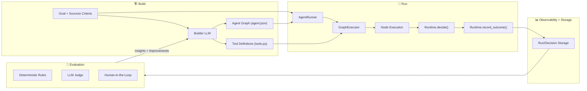

# Hive (Aden Agent Framework) Onboarding Tutorial

This tutorial walks you through understanding the Hive (Aden Agent Framework) codebase, setting up your environment, and running a minimal agent. It is designed to help you become productive quickly while pointing to the most relevant reference docs in the repo.

> **Scope**: This guide is for developers who want to understand the architecture and code layout, then run or build agents. It assumes basic Python and Git familiarity.

---

## 1. What you’re working with

Hive is a **goal-driven agent framework** that builds and runs agent graphs, captures decision traces, and uses those traces to improve agent behavior. The framework focuses on:

- **Goal-driven development** (define objectives and success criteria).
- **Decision logging** (record intent → options → choice → outcome).
- **Evaluation & improvement loops** (rules + LLM judging + human oversight).

Start with the project overview and developer guide for the global picture:

- [`README.md`](../README.md) — project overview, features, and high-level architecture.
- [`DEVELOPER.md`](../DEVELOPER.md) — repository structure, setup, and workflows.

---

## 2. Repository map (the essentials)

Use this map to orient yourself:

```
hive/
├── core/                    # Framework runtime package (agent execution)
│   ├── framework/           # Core runtime, graph executor, protocols
│   ├── README.md            # Runtime overview and MCP setup
│   └── docs/                # Protocol documentation
├── tools/                   # MCP tools package (19 tools, MCP server)
├── docs/                    # Documentation (architecture, getting started, etc.)
├── scripts/                 # Setup scripts
├── exports/                 # User-generated agents (usually gitignored)
└── quickstart.sh            # Installs Claude Code skills
```

Reference docs:
- [`docs/getting-started.md`](./getting-started.md) — quick start and workflows.
- [`core/README.md`](../core/README.md) — runtime and MCP server overview.

---

## 3. Set up your environment

Follow the repo’s Python setup script. This installs the `framework` and `aden_tools` packages in editable mode and resolves dependencies.

```bash
./scripts/setup-python.sh
```

Then validate the installs:

```bash
python -c "import framework; import aden_tools; print('✓ Setup complete')"
```

If you intend to run real LLMs, configure API keys as described in:
- [`ENVIRONMENT_SETUP.md`](../ENVIRONMENT_SETUP.md)
- [`docs/getting-started.md`](./getting-started.md)

---

## 4. Understand the runtime model (core framework)

The core runtime captures **decisions**, not just outputs. That means you can later analyze *why* an agent did something, not just *what* it did.

Key runtime components:

- **Runtime** — the API agents use to log decisions/outcomes.
- **Graph Executor** — loads and executes agent node graphs.
- **BuilderQuery** — analyzes runs and suggests improvements.

Read:
- [`core/README.md`](../core/README.md) for a conceptual overview and example API usage.
- [`DEVELOPER.md`](../DEVELOPER.md) for the directory structure and component locations.

---

## 5. System architecture graph

Use the following diagram to visualize how goals become agent graphs, how those graphs are executed, and where evaluation/feedback loops plug in:



---

## 6. Learn the evaluation strategy (triangulation)

Hive emphasizes **triangulated verification** to avoid overfitting to a single ground-truth signal:

1. **Deterministic rules** — fast, precise checks.
2. **Semantic evaluation** — LLM-based judgments with confidence gating.
3. **Human judgment** — escalation for high-stakes or ambiguous decisions.

This is documented in the architecture materials. Review:
- [`docs/architecture/README.md`](./architecture/README.md)

---

## 7. Build or inspect an agent

### Option A: Use Claude Code skills (recommended)

Install skills:

```bash
./quickstart.sh
```

Then run:

```bash
claude> /building-agents
```

This will guide you through goal definition, node design, graph generation, and testing.

### Option B: Inspect a minimal manual agent

The docs note a minimal example in `core/examples/manual_agent.py`. Use this to understand the runtime loop without LLM configuration.

```bash
PYTHONPATH=core python core/examples/manual_agent.py
```

Reference:
- [`docs/getting-started.md`](./getting-started.md)

---

## 8. Run an agent end-to-end

Use the Python module interface for an agent package:

```bash
PYTHONPATH=core:exports python -m my_agent validate
PYTHONPATH=core:exports python -m my_agent info
PYTHONPATH=core:exports python -m my_agent run --input '{ "task": "..." }'
```

See:
- [`docs/getting-started.md`](./getting-started.md)

---

## 9. Testing and iteration

Hive provides a testing framework that aligns with agent goals (not just unit tests):

```bash
python -m framework test-run <agent_path> --goal <goal_id> --parallel 4
python -m framework test-list <goal_id>
python -m framework test-debug <agent_path> <test_name>
```

Reference:
- [`core/README.md`](../core/README.md)

---

## 10. Recommended learning path (practical)

1. **Read**: `README.md` → `DEVELOPER.md` → `docs/getting-started.md`
2. **Explore**: `core/framework/runner/` and `core/framework/executor/`
3. **Run**: `core/examples/manual_agent.py`
4. **Build**: Use `/building-agents` (Claude Code)
5. **Test**: Use framework test commands

---

## 11. Where to go next

If you want to dive deeper into:

- **Tooling and MCP server** → `tools/` and `core/README.md`
- **System design** → `docs/architecture/README.md`
- **Project contribution** → `CONTRIBUTING.md`
- **Roadmap** → `ROADMAP.md`

---

## Quick reference (commands)

```bash
# Setup
./scripts/setup-python.sh

# Verify installation
python -c "import framework; import aden_tools; print('✓ Setup complete')"

# Run minimal example
PYTHONPATH=core python core/examples/manual_agent.py

# Validate and run an agent (after creating one)
PYTHONPATH=core:exports python -m my_agent validate
PYTHONPATH=core:exports python -m my_agent run --input '{ "task": "..." }'
```

---

If you'd like, tell me which area you want to explore first (runtime internals, MCP tooling, evaluation, or agent authoring), and I can map specific files and call paths for you.
