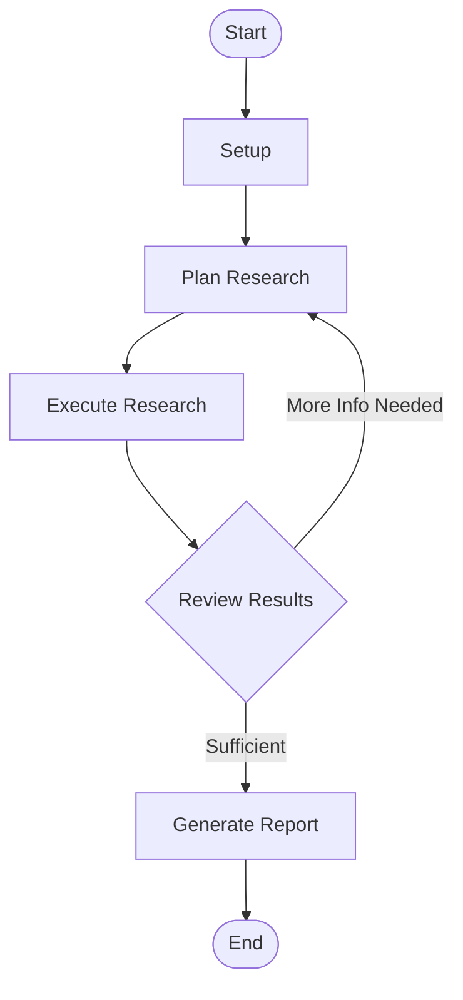

# Deep Research Agent

A sophisticated research agent that performs deep, iterative research on any topic. It uses a graph-based execution model to plan research steps, execute queries, synthesize findings, and produce comprehensive reports.

## Architecture

This agent uses a `StateGraph` to manage its execution flow. The graph orchestrates the interaction between the planner, researcher, and reviewer nodes.



### Components

#### Nodes
1.  **Planner**: Analyzes the research topic and breaks it down into specific search queries and sub-tasks.
2.  **Researcher**: Executes search queries using available tools (e.g., `web_search`) and gathers raw information.
3.  **Reviewer**: Evaluates the gathered information against the research goals. Decides whether to continue researching or finalize the report.
4.  **Reporter**: Synthesizes all findings into a structured markdown report.

#### Edges
-   **Plan -> Research**: Moves from planning to execution.
-   **Research -> Review**: Submits findings for evaluation.
-   **Review -> Plan** (Feedback Loop): If information is missing, returns to planning with specific feedback.
-   **Review -> Report**: If goals are met, proceeds to report generation.

## Goal Criteria

The agent's success is determined by the `Reviewer` node based on the following criteria:

-   **Completeness**: Have all aspects of the user's query been addressed?
-   **Depth**: Is the information sufficiently detailed (not just surface-level)?
-   **Accuracy**: Are the sources reliable and cited?
-   **Clarity**: Is the final report well-structured and easy to read?

### Constraints
-   Maximum iteration limit: 10 steps (configurable).
-   Must cite sources for all key claims.

## Usage

### CLI

Run the agent directly from the command line:

```bash
python examples/templates/deep_research_agent/agent.py start --topic "The future of quantum computing"
```

### Python API

Integrate the agent into your application:

```python
from examples.templates.deep_research_agent.agent import DeepResearchAgent

agent = DeepResearchAgent()
result = agent.run(topic="The impact of AI on healthcare")
print(result)
```

## Configuration

The agent can be configured via environment variables or direct initialization parameters:

-   `MAX_ITERATIONS`: Maximum number of research cycles (default: 10).
-   `SEARCH_PROVIDER`: Search engine to use (default: `tavily`).
-   `MODEL_NAME`: LLM model to use (default: `gpt-4o`).
