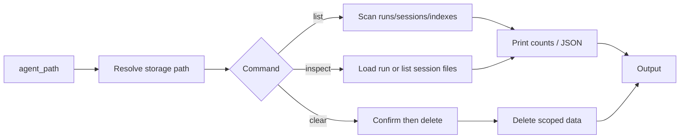

# Design proposal: CLI for memory / storage management

**Context:** Feature request for a CLI to list, inspect, and clear agent runtime storage.

---

## 1. Overview and goals

### Goals

- **Discoverability:** Developers can see what runtime data exists for an agent (runs, sessions, indexes) without opening the filesystem manually.
- **Inspection:** Developers can inspect a specific run or session (summary, structure) from the CLI for debugging.
- **Controlled cleanup:** Developers can clear storage (runs, sessions, or all) with explicit confirmation, scoped to a single agent.

### Non-goals (out of scope)

- Modifying run or session content (no edit/merge).
- Managing credentials or agent config (separate CLI or docs).
- A GUI or dashboard (CLI only; UI can be added later).
- Cross-agent operations (only one agent per command).

---

## 2. Current storage layout (authoritative)

Runtime storage for an agent lives under a single **storage path**. Default resolution (today):

- **Default path:** `~/.hive/storage/{agent_name}/` (see `AgentRunner` in `core/framework/runner/runner.py`).
- **Override:** `storage_path` can be passed when loading the agent (e.g. for tests or custom dirs).

**Layout under storage path** (from `FileStorage` and executor usage):

```
{storage_path}/
  runs/                    # Full run data (Run model as JSON)
    {run_id}.json
  summaries/               # RunSummary per run (quick scan)
    {run_id}.json
  indexes/
    by_goal/
      {goal_id}.json       # List of run IDs for this goal
    by_status/
      {status}.json        # List of run IDs (e.g. completed.json)
    by_node/
      {node_id}.json       # List of run IDs that used this node
  sessions/                # Per-execution data (ExecutionStream)
    {execution_id}/
      ...                  # conversations/, data/ (executor-specific)
```

- **runs/** and **summaries/** are written by `FileStorage` (`core/framework/storage/backend.py`).
- **indexes/** are maintained by `FileStorage` when runs are saved.
- **sessions/** are created by the executor (`core/framework/runtime/execution_stream.py`: `exec_storage = self._storage.base_path / "sessions" / execution_id`). Contents are executor-specific (e.g. conversation store, spillover data).

**Resolution rule:** Storage path is resolved the same way as for `hive run` / `hive info`: from `agent_path` (e.g. `exports/my-agent`) we derive agent name and thus default `~/.hive/storage/{agent_name}`. Optional `--storage-path` can override for advanced use.

---

## 3. CLI surface

### Subcommand

Introduce a single subcommand: **`hive memory`** (alternatives: `hive storage`; we can bikeshed). Three actions: **list**, **inspect**, **clear**.

### Commands and arguments

| Command | Arguments | Purpose |
|--------|-----------|--------|
| `hive memory list <agent_path>` | `[--size]` `[--json]` `[--storage-path PATH]` | List runs, sessions, index counts; optional disk usage; optional machine-readable output. |
| `hive memory inspect <agent_path> <run_id\|session_id>` | `[--full]` `[--json]` `[--storage-path PATH]` | Show summary/structure for a run or session. For runs: summary fields; `--full` for full run JSON. For sessions: list of files under that session dir (no file contents by default). |
| `hive memory clear <agent_path>` | `[--runs \| --sessions \| --all]` `[--yes]` `[--storage-path PATH]` | Delete data. Scope: `--runs` (runs + summaries + indexes), `--sessions`, or `--all`. Require `--yes` or interactive confirmation. |

### Agent path

- Same semantics as existing commands: `agent_path` is the path to the agent folder (e.g. `exports/my-agent` or `path/to/my-agent`). Resolution logic should be reused from `cmd_run` / `cmd_info` (resolve to absolute path, derive agent name for default storage).

### Storage path override

- `--storage-path PATH`: Use this directory as the agent’s storage root instead of `~/.hive/storage/{agent_name}`. Useful for custom layouts or tests. When provided, we do not require the agent dir to exist (only the storage path).

### Flow diagram

```
┌─────────────────┐     ┌──────────────────────┐     ┌─────────────────┐
│  agent_path +    │     │  Resolve storage     │     │    Command      │
│  --storage-path? │────►│  path (default or    │────►│  list | inspect  │
│                  │     │  override)           │     │  | clear         │
└─────────────────┘     └──────────────────────┘     └────────┬────────┘
                                        │                      │
                                        │                      ▼
                                        │             ┌────────────────┐
                                        │             │ list: scan      │
                                        │             │ runs/, sessions/│
                                        │             │ indexes/; print│
                                        │             │ counts [--size] │
                                        │             └────────────────┘
                                        │             ┌────────────────┐
                                        │             │ inspect: load   │
                                        │             │ run summary or  │
                                        │             │ list session    │
                                        │             │ files           │
                                        │             └────────────────┘
                                        │             ┌────────────────┐
                                        │             │ clear: confirm  │
                                        │             │ then delete     │
                                        │             │ --runs|sessions │
                                        │             │ |--all          │
                                        │             └────────────────┘
                                        │                      │
                                        ▼                      ▼
                             ┌──────────────────────────────────────┐
                             │  All operations stay under storage   │
                             │  path; no path traversal              │
                             └──────────────────────────────────────┘
```

Mermaid version:



---

## 4. Command behavior (spec)

### 4.1 `hive memory list <agent_path> [--size] [--json] [--storage-path PATH]`

**Behavior:**

- Resolve storage path (default or `--storage-path`). If the directory does not exist, output a clear message (e.g. “No storage found for this agent”) and exit 0 with empty counts.
- Scan (read-only):
  - **runs:** count of `runs/*.json`
  - **summaries:** count of `summaries/*.json`
  - **indexes:** count of index files under `indexes/by_goal`, `by_status`, `by_node` (or list unique goal/status/node keys)
  - **sessions:** count of direct children of `sessions/` (each is an execution_id dir)
- If `--size`: compute total size of the storage path (sum of file sizes under that path).
- Output:
  - **Human:** Print storage path, then lines like: `runs: N`, `summaries: N`, `sessions: N`, optional `size: X MB`. Optionally one line per index type (by_goal / by_status / by_node) if useful.
  - **JSON (`--json`):** Single object with keys e.g. `storage_path`, `runs`, `summaries`, `sessions`, `indexes` (counts or breakdown), optional `size_bytes`.

**Edge cases:**

- Empty storage: all counts 0, size 0 if `--size`.
- Missing agent path: same as existing CLI (error and exit non-zero).
- Invalid `--storage-path`: error and exit non-zero.

### 4.2 `hive memory inspect <agent_path> <run_id|session_id> [--full] [--json] [--storage-path PATH]`

**Behavior:**

- Resolve storage path.
- **If second argument looks like a run_id** (e.g. matches existing `runs/{run_id}.json` or `summaries/{run_id}.json`):
  - Load summary from `summaries/{run_id}.json` if present; else load run from `runs/{run_id}.json` and derive a summary view.
  - Print: run_id, goal_id, status, duration_ms, decision_count, success_rate, problem_count, narrative (and optionally key_decisions / critical_problems / warnings).
  - With `--full`: print full run JSON from `runs/{run_id}.json` (no redaction today; if we ever store secrets there, we add redaction later).
  - With `--json`: output a single JSON object (summary or full run).
- **If second argument is treated as session_id** (e.g. no run file, but `sessions/{session_id}/` exists):
  - List files under `sessions/{session_id}/` (recursively): relative paths and sizes only. Do not print file contents (avoid leaking sensitive data).
  - With `--json`: output a list of objects like `{"path": "...", "size": N}`.
- If neither run nor session exists: error “Run or session not found: …” and exit non-zero.

**Identification rule:** We can decide a simple rule: e.g. if `runs/{id}.json` or `summaries/{id}.json` exists, treat as run_id; else if `sessions/{id}/` exists, treat as session_id; else not found.

### 4.3 `hive memory clear <agent_path> [--runs | --sessions | --all] [--yes] [--storage-path PATH]`

**Behavior:**

- Require exactly one of `--runs`, `--sessions`, or `--all`. If none, print usage and exit non-zero.
- Resolve storage path. If it does not exist, exit 0 (nothing to do).
- **Confirmation:**
  - If `--yes`: skip prompt.
  - Else: prompt “Remove {scope} for agent …? [y/N]”. If not y/yes, abort and exit 0.
- **Scope:**
  - **--runs:** Delete all files in `runs/`, `summaries/`, and all files under `indexes/` (by_goal, by_status, by_node). Do not touch `sessions/`.
  - **--sessions:** Delete only the contents of `sessions/` (each subdir is an execution_id). Do not touch runs/summaries/indexes.
  - **--all:** Delete the entire storage path directory (after confirmation). Equivalent to “rm -rf {storage_path}” in effect; directory will be recreated on next run.
- After delete: print “Cleared …” and exit 0.
- **Safety:** All operations are restricted to the resolved storage path. No path traversal; use the same kind of validation as `FileStorage._validate_key` for any user-supplied path segments (e.g. if we ever allow “clear one run” by id, resolve run_id to a single file under runs/ and delete only that file).

**Edge cases:**

- Storage path does not exist: do nothing, exit 0.
- Concurrent run: We do not lock the storage for “clear”. Clear is best-effort; if a run is writing at the same time, the design accepts possible partial state. Documentation can recommend “don’t clear while the agent is running” for consistency.

### Example session

Example terminal session showing list, inspect (run and session), and clear. Output is illustrative.

**List storage (human-readable):**

```bash
$ hive memory list exports/my-agent
Storage: /Users/me/.hive/storage/my-agent
  runs:      12
  summaries: 12
  sessions:  3
  indexes:   by_goal(2) by_status(3) by_node(5)
```

**List with disk usage:**

```bash
$ hive memory list exports/my-agent --size
Storage: /Users/me/.hive/storage/my-agent
  runs: 12   summaries: 12   sessions: 3
  size: 2.4 MB
```

**List as JSON:**

```bash
$ hive memory list exports/my-agent --json
{"storage_path": "/Users/me/.hive/storage/my-agent", "runs": 12, "summaries": 12, "sessions": 3, "indexes": {"by_goal": 2, "by_status": 3, "by_node": 5}}
```

**Inspect a run (summary):**

```bash
$ hive memory inspect exports/my-agent run_abc123
run_id: run_abc123
goal_id: my_goal
status: completed
duration_ms: 4500
decision_count: 8
success_rate: 1.0
problem_count: 0
narrative: Run completed successfully. Made 8 decisions: 8 succeeded, 0 failed.
```

**Inspect a session (file listing):**

```bash
$ hive memory inspect exports/my-agent exec_xyz789
Session: exec_xyz789
  conversations/node_1/   (dir)
  data/spillover.json     1024
  data/context.json       512
```

**Clear sessions (with confirmation):**

```bash
$ hive memory clear exports/my-agent --sessions
Remove sessions for agent my-agent? [y/N] y
Cleared sessions for /Users/me/.hive/storage/my-agent
```

**Clear all (non-interactive):**

```bash
$ hive memory clear exports/my-agent --all --yes
Cleared all storage for /Users/me/.hive/storage/my-agent
```

**No storage yet:**

```bash
$ hive memory list exports/new-agent
No storage found for this agent (path does not exist).
  runs: 0   summaries: 0   sessions: 0
```

---

## 5. Safety and validation

- **Single agent:** Every command operates on one resolved storage path. No bulk “clear all agents” in this design.
- **Path containment:** All resolved paths must be under the chosen storage root. Use `Path.resolve()` and check that the canonical path starts with the storage root (or equals it). Reject `..` and absolute paths that escape the root.
- **Confirmation:** Clear always requires either `--yes` or an interactive prompt. No silent mass delete.
- **Read-only by default:** List and inspect do not modify storage. Clear is the only destructive action and is explicit.

---

## 6. Implementation approach

### 6.1 Placement

- **Option A (recommended):** New module under `core/framework/runner/`, e.g. `memory_cli.py`, that implements `list`, `inspect`, `clear` and is called from the main CLI. Register `hive memory` in `core/framework/runner/cli.py` (add a subparser `memory` with sub-subparsers for list / inspect / clear), reusing existing agent-path and storage-path resolution helpers if any.
- **Option B:** Implement under `core/framework/cli.py` as a separate branch. Prefer A for consistency with run/info/validate.

### 6.2 Storage path resolution

- Extract or reuse a small helper: `(agent_path: Path, storage_path_override: Path | None) -> Path` that returns the storage path (default `~/.hive/storage/{agent_path.name}` or override). Use the same rule as `AgentRunner.load(..., storage_path=...)` so that `hive run` and `hive memory` agree.

### 6.3 Listing

- Use `Path.iterdir()` / `Path.glob()` on the storage path. Do not instantiate `FileStorage` for list (avoid creating dirs). If the directory does not exist, treat as “empty” and return zero counts.

### 6.4 Inspect (run)

- Read `summaries/{run_id}.json` or `runs/{run_id}.json`; parse with existing Pydantic models (`RunSummary`, `Run`) so the format stays consistent. Output selected fields or full JSON.

### 6.5 Inspect (session)

- List `sessions/{session_id}/` recursively; output relative paths and sizes. No need to parse conversation format.

### 6.6 Clear

- For `--runs`: delete files in `runs/`, `summaries/`, and `indexes/**/*`. For `--sessions`: delete subdirs of `sessions/`. For `--all`: delete the storage path directory. Use `shutil.rmtree` or equivalent; ensure we only pass paths that are under the resolved storage root.

### 6.7 Tests

- **Unit:** Temp directory as storage path; create runs/summaries/indexes/sessions; run list (check counts, optional size), inspect (run and session), clear (each scope); assert directory state after clear.
- **Integration (optional):** Run an agent once, then `hive memory list` / `hive memory inspect <run_id>` and assert non-empty output.

### 6.8 Phasing

- **Phase 1:** `list` and `inspect` (read-only). Ship and gather feedback.
- **Phase 2:** `clear` with `--runs`, `--sessions`, `--all` and confirmation. Enables “start fresh” and “free disk” without touching code.

---

## 7. Open questions

1. **Subcommand name:** `hive memory` vs `hive storage` — “memory” is friendlier; “storage” is more precise. Preference?
2. **Inspect run_id vs session_id:** Allow both in one command (as above) or split into `hive memory inspect-run` and `hive memory inspect-session`? Single command with a single id argument keeps the CLI small; we can document that ids are either run_ids or session_ids.
3. **Clear single run/session:** Omit for v1 (clear is scoped to runs/sessions/all). We can add “clear one run by id” later if needed.
4. **Concurrent run:** Document that clearing while the agent is running is unsupported; no locking in this design.

---

## 8. Summary

| Item | Proposal |
|------|----------|
| **CLI** | `hive memory list | inspect | clear` with shared `<agent_path>` and optional `--storage-path`. |
| **List** | Read-only scan of runs/, summaries/, indexes/, sessions/; optional `--size` and `--json`. |
| **Inspect** | Run: summary or full JSON from existing Run/RunSummary. Session: list of files (paths + sizes), no contents. |
| **Clear** | `--runs` / `--sessions` / `--all` with `--yes` or interactive confirmation; all operations under one storage path. |
| **Safety** | Path containment, confirmation for clear, no cross-agent or path-traversal. |
| **Implementation** | New `memory_cli.py` under runner; reuse storage-path resolution; unit tests + optional integration test. |
| **Phasing** | Phase 1: list + inspect; Phase 2: clear. |

This design keeps the feature scoped, aligns with existing storage layout and CLI patterns, and leaves room to extend (e.g. clear-by-id, locking) later.
